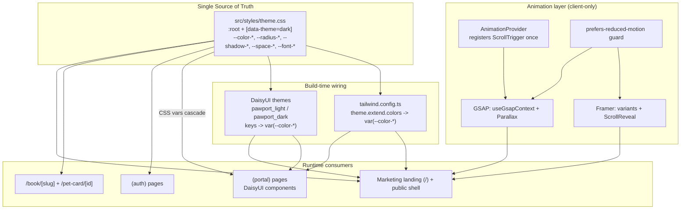
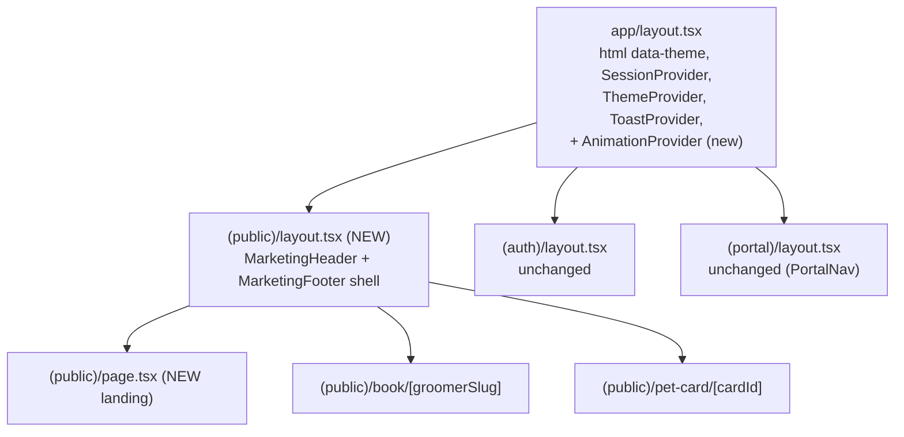
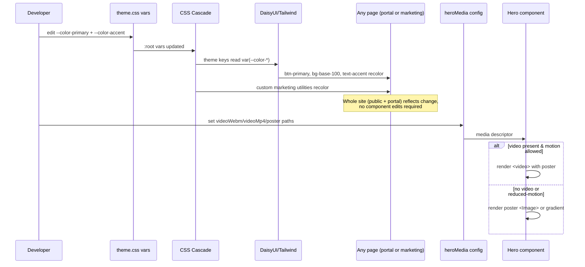
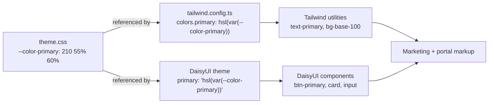
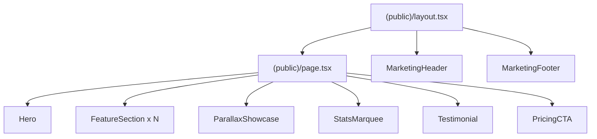

# Design Document: Aesthetic Redesign

## Overview

This feature layers a modern, motion-rich visual redesign on top of the existing, fully-functional PawPort application (Next.js 14 App Router, TypeScript, Tailwind CSS, DaisyUI, Framer Motion). It is **additive**: it introduces a new public marketing experience and a single central theme file that becomes the source of truth for the entire site's look, without re-architecting or regressing any existing feature (auth, booking flow, groomer portal, digital pet card).

Two concerns are separated deliberately:

1. **Theming (site-wide).** A single CSS file, `src/styles/theme.css`, declares all design tokens (colors, semantic aliases, radii, shadows, spacing, typography) as CSS custom properties, with a `[data-theme="dark"]` override block. `tailwind.config.ts` and the DaisyUI custom themes are refactored to *reference* these variables rather than hold literal hex values. The result: editing one file recolors both the public marketing pages and the authenticated portal, and light/dark toggling swaps only a variable block (driven by the existing `next-themes` setup).

2. **Motion & marketing (public surface).** A new marketing landing page at `/`, a shared public marketing shell (animated header + footer), and a reusable animation utilities layer. Framer Motion continues to own component/route/step transitions and simple in-view reveals; GSAP + ScrollTrigger is added for scroll-timeline work (parallax, pinned sections, scrubbed reveals). The two libraries never animate the same property on the same element.

The authenticated portal inherits the new color tokens automatically (because DaisyUI now reads them) but is **not** re-choreographed with scroll animations — it stays a fast, functional tool.

## Design Decisions

These are the defaults chosen for this design. Each is a deliberate decision, noted so it can be revisited.

- **D1 — Scope.** Add a NEW public marketing landing page at `/` (replacing the current placeholder `src/app/page.tsx`) plus a new shared public marketing layout/shell (header nav + footer) under a `(public)` context. The booking page (`/book/[groomerSlug]`) and pet-card page (`/pet-card/[cardId]`) keep their existing behavior but adopt the new theme and shell styling. The authenticated portal and auth pages remain functional and inherit the central color tokens but are not given scroll choreography.
- **D2 — Central theme file.** `src/styles/theme.css` holds `:root` custom properties and a `[data-theme="dark"]` override. `tailwind.config.ts` `theme.extend.colors` and the DaisyUI theme keys reference these variables via `var(--…)`. One file drives everything; light/dark switches by swapping the variable block.
- **D3 — Hero media.** The hero uses config slots + placeholders: a required poster image and an optional `mp4`/`webm` path read from a small config module. The design renders gracefully with no real video asset (falls back to poster, then to a CSS gradient). The user can drop assets into `public/media/` later without code changes.
- **D4 — Library ownership.** Framer Motion: route/page/step transitions, in-view fade/slide reveals, micro-interactions (hover/tap). GSAP + ScrollTrigger: scroll-scrubbed parallax layers, pinned sections, long scroll timelines. No element is animated on the same CSS property by both libraries.
- **D5 — SSR safety.** GSAP and ScrollTrigger run client-side only. Plugins are registered once in a client provider effect; every access to `window`/`document` is guarded. Marketing animation components are `'use client'`.
- **D6 — Accessibility.** A global `prefers-reduced-motion` check disables scrubbed/parallax motion and collapses reveals to instant opacity, honored by both the Framer variants library and the GSAP context helper.
- **D7 — No regression.** The existing `ThemeProvider` (next-themes), `PageTransition`, `BookingFlow` step transitions, and DaisyUI component classes keep working unchanged. Only token *sources* change, not token *names* (`primary`, `base-100`, etc. stay identical), so existing markup is untouched.

## High-Level Design

### System / Architecture Diagram



### Route Group Structure

The App Router route groups are preserved. The redesign adds a `(public)` group layout and moves the landing page under it (the URL stays `/` because route groups do not affect the path).



> Note: the current landing lives at `src/app/page.tsx` (root, no group). The migration relocates it to `src/app/(public)/page.tsx` so it shares the new marketing shell. `book/` and `pet-card/` already live in `(public)`.

### Data / Asset Flow

There is no application data model change. The "data" here is design tokens and media configuration.



## The Central Theme Mechanism (Detailed)

### Goal

One file — `src/styles/theme.css` — is the single source of truth for the entire site's visual tokens. DaisyUI components (used across the portal), the existing pages, and the new marketing components all resolve their colors, radii, shadows, and type from these variables. Light/dark is a swap of one variable block, driven by the existing `next-themes` `data-theme` attribute.

### How the pieces connect



Key idea: colors are stored as **HSL channel triples** (e.g. `210 55% 60%`), not full `hsl(...)` strings. This lets both Tailwind and DaisyUI wrap them with `hsl(var(--x) / <alpha>)` so opacity modifiers (`bg-primary/20`) keep working, and DaisyUI can compute `-content` contrast colors.

### `src/styles/theme.css` (full contents)

```css
/* =====================================================================
   PawPort — Central Theme Tokens (single source of truth)
   Edit THIS file to re-theme the entire site (marketing + portal).
   Colors are HSL channel triples: "H S% L%" so consumers can apply
   alpha via hsl(var(--x) / <alpha>).
   ===================================================================== */

:root,
[data-theme='pawport_light'] {
  /* ---- Brand palette (luxury mobile pet spa) ---- */
  --color-primary: 210 55% 60%;      /* soft blue      #5B9BD5 */
  --color-primary-content: 0 0% 100%;
  --color-secondary: 344 74% 80%;    /* gentle pink    #F5A5B8 */
  --color-secondary-content: 220 26% 17%;
  --color-accent: 180 39% 64%;       /* calm teal      #7EC8C8 */
  --color-accent-content: 220 26% 17%;
  --color-neutral: 220 9% 46%;       /* warm neutral   #6B7280 */
  --color-neutral-content: 210 20% 98%;

  /* ---- Surfaces ---- */
  --color-base-100: 0 0% 100%;       /* page bg        #FFFFFF */
  --color-base-200: 210 20% 98%;     /* raised surface #F9FAFB */
  --color-base-300: 220 14% 96%;     /* border/well    #F3F4F6 */
  --color-base-content: 220 26% 17%; /* body text      #1F2937 */

  /* ---- Status ---- */
  --color-info: 213 94% 68%;
  --color-success: 158 64% 52%;
  --color-warning: 43 96% 56%;
  --color-error: 0 91% 71%;

  /* ---- Marketing-only accents (warm neutrals + glow) ---- */
  --color-cream: 40 33% 96%;         /* warm off-white section bg */
  --color-sand: 35 30% 88%;          /* warm neutral band */
  --color-ink: 222 47% 11%;          /* near-black headings */

  /* ---- Radii ---- */
  --radius-sm: 0.375rem;
  --radius-md: 0.5rem;   /* = DaisyUI --rounded-btn */
  --radius-lg: 1rem;     /* = DaisyUI --rounded-box */
  --radius-xl: 1.75rem;
  --radius-full: 9999px;

  /* ---- Shadows ---- */
  --shadow-card: 0 4px 6px -1px rgb(0 0 0 / 0.05), 0 2px 4px -2px rgb(0 0 0 / 0.05);
  --shadow-soft: 0 10px 30px -12px rgb(31 41 55 / 0.18);
  --shadow-glow: 0 0 60px -12px hsl(var(--color-primary) / 0.45);

  /* ---- Spacing scale (section rhythm) ---- */
  --space-section: clamp(4rem, 10vw, 9rem);
  --space-gutter: clamp(1rem, 5vw, 3rem);

  /* ---- Typography ---- */
  --font-sans: 'Inter', 'Geist', system-ui, sans-serif;
  --font-display: 'Inter', system-ui, sans-serif; /* swap for a display face later */
  --text-hero: clamp(2.75rem, 7vw, 5.5rem);
  --text-h2: clamp(1.75rem, 4vw, 3rem);
  --leading-tight: 1.08;

  /* ---- Motion ---- */
  --ease-out-expo: cubic-bezier(0.16, 1, 0.3, 1);
  --dur-reveal: 0.7s;
}

[data-theme='pawport_dark'] {
  --color-primary: 210 71% 70%;      /* #7BB8E8 */
  --color-primary-content: 222 47% 11%;
  --color-secondary: 344 74% 80%;
  --color-secondary-content: 222 47% 11%;
  --color-accent: 180 39% 64%;
  --color-accent-content: 222 47% 11%;
  --color-neutral: 217 19% 27%;
  --color-neutral-content: 210 20% 98%;

  --color-base-100: 220 26% 17%;     /* #1F2937 */
  --color-base-200: 221 39% 11%;     /* #111827 */
  --color-base-300: 222 47% 11%;     /* #0F172A */
  --color-base-content: 210 20% 98%;

  --color-cream: 220 26% 20%;
  --color-sand: 221 39% 14%;
  --color-ink: 210 20% 98%;

  --shadow-card: 0 4px 6px -1px rgb(0 0 0 / 0.4), 0 2px 4px -2px rgb(0 0 0 / 0.4);
  --shadow-soft: 0 10px 30px -12px rgb(0 0 0 / 0.6);
  --shadow-glow: 0 0 60px -12px hsl(var(--color-primary) / 0.55);
}

/* Accessibility: collapse motion tokens when the user prefers reduced motion */
@media (prefers-reduced-motion: reduce) {
  :root {
    --dur-reveal: 0.001s;
  }
}
```

`theme.css` is imported once, before Tailwind's layers, from `globals.css`:

```css
/* src/app/globals.css */
@import '../styles/theme.css';   /* MUST come first: defines vars Tailwind/DaisyUI read */

@tailwind base;
@tailwind components;
@tailwind utilities;

html { font-size: 16px; }
body { min-height: 100vh; line-height: 1.5; font-family: var(--font-sans); }
```

### `tailwind.config.ts` refactor

Colors are expressed as functions so alpha modifiers keep working. Radii/shadows/spacing/type also read the vars, so utility classes (`rounded-lg`, `shadow-soft`, `text-hero`) stay in sync with the central file.

```typescript
import type { Config } from 'tailwindcss';
import daisyui from 'daisyui';

/** Wraps an HSL-triple CSS var so Tailwind alpha modifiers (bg-primary/40) work. */
const hsl = (v: string) => `hsl(var(${v}) / <alpha-value>)`;

const config: Config = {
  content: ['./src/**/*.{js,ts,jsx,tsx,mdx}'],
  theme: {
    extend: {
      colors: {
        primary: hsl('--color-primary'),
        'primary-content': hsl('--color-primary-content'),
        secondary: hsl('--color-secondary'),
        'secondary-content': hsl('--color-secondary-content'),
        accent: hsl('--color-accent'),
        'accent-content': hsl('--color-accent-content'),
        neutral: hsl('--color-neutral'),
        'neutral-content': hsl('--color-neutral-content'),
        'base-100': hsl('--color-base-100'),
        'base-200': hsl('--color-base-200'),
        'base-300': hsl('--color-base-300'),
        'base-content': hsl('--color-base-content'),
        info: hsl('--color-info'),
        success: hsl('--color-success'),
        warning: hsl('--color-warning'),
        error: hsl('--color-error'),
        // marketing-only tokens
        cream: hsl('--color-cream'),
        sand: hsl('--color-sand'),
        ink: hsl('--color-ink'),
      },
      fontFamily: {
        sans: ['var(--font-inter)', 'Inter', 'system-ui', 'sans-serif'],
        display: ['var(--font-display)', 'Inter', 'system-ui', 'sans-serif'],
      },
      fontSize: {
        base: ['16px', { lineHeight: '1.5' }],
        hero: ['var(--text-hero)', { lineHeight: 'var(--leading-tight)' }],
        h2: ['var(--text-h2)', { lineHeight: '1.15' }],
      },
      borderRadius: {
        sm: 'var(--radius-sm)',
        md: 'var(--radius-md)',
        lg: 'var(--radius-lg)',
        '2xl': 'var(--radius-lg)', // keep existing "2xl" callers valid
        xl: 'var(--radius-xl)',
        full: 'var(--radius-full)',
      },
      boxShadow: {
        card: 'var(--shadow-card)',
        soft: 'var(--shadow-soft)',
        glow: 'var(--shadow-glow)',
      },
      spacing: {
        section: 'var(--space-section)',
        gutter: 'var(--space-gutter)',
      },
      transitionTimingFunction: {
        'out-expo': 'var(--ease-out-expo)',
      },
    },
  },
  plugins: [daisyui],
  daisyui: {
    themes: [
      {
        pawport_light: {
          primary: 'hsl(var(--color-primary))',
          'primary-content': 'hsl(var(--color-primary-content))',
          secondary: 'hsl(var(--color-secondary))',
          'secondary-content': 'hsl(var(--color-secondary-content))',
          accent: 'hsl(var(--color-accent))',
          'accent-content': 'hsl(var(--color-accent-content))',
          neutral: 'hsl(var(--color-neutral))',
          'neutral-content': 'hsl(var(--color-neutral-content))',
          'base-100': 'hsl(var(--color-base-100))',
          'base-200': 'hsl(var(--color-base-200))',
          'base-300': 'hsl(var(--color-base-300))',
          'base-content': 'hsl(var(--color-base-content))',
          info: 'hsl(var(--color-info))',
          success: 'hsl(var(--color-success))',
          warning: 'hsl(var(--color-warning))',
          error: 'hsl(var(--color-error))',
          '--rounded-box': 'var(--radius-lg)',
          '--rounded-btn': 'var(--radius-md)',
        },
      },
      {
        pawport_dark: {
          // Same var references — the values differ only because the
          // [data-theme="dark"] block in theme.css overrides the vars.
          primary: 'hsl(var(--color-primary))',
          'primary-content': 'hsl(var(--color-primary-content))',
          secondary: 'hsl(var(--color-secondary))',
          'secondary-content': 'hsl(var(--color-secondary-content))',
          accent: 'hsl(var(--color-accent))',
          'accent-content': 'hsl(var(--color-accent-content))',
          neutral: 'hsl(var(--color-neutral))',
          'neutral-content': 'hsl(var(--color-neutral-content))',
          'base-100': 'hsl(var(--color-base-100))',
          'base-200': 'hsl(var(--color-base-200))',
          'base-300': 'hsl(var(--color-base-300))',
          'base-content': 'hsl(var(--color-base-content))',
          info: 'hsl(var(--color-info))',
          success: 'hsl(var(--color-success))',
          warning: 'hsl(var(--color-warning))',
          error: 'hsl(var(--color-error))',
          '--rounded-box': 'var(--radius-lg)',
          '--rounded-btn': 'var(--radius-md)',
        },
      },
    ],
    darkTheme: 'pawport_dark',
    base: true,
    styled: true,
    utils: true,
  },
};

export default config;
```

> **Important nuance (noted decision):** DaisyUI v4 expects color values it can parse for computing contrast. Providing `hsl(var(--…))` strings makes DaisyUI defer to the CSS variable at runtime, which works for applying colors but means DaisyUI's *auto* `-content` computation is bypassed. That is why every `-content` token is defined explicitly in `theme.css` and mapped here. This keeps full control in the central file and avoids relying on DaisyUI's automatic contrast math.

### Light/Dark swap

Nothing in components or config changes between themes. `next-themes` (already configured in `ThemeProvider`, `attribute="data-theme"`, themes `['pawport_light','pawport_dark']`) sets `data-theme` on `<html>`. When it becomes `pawport_dark`, the `[data-theme='pawport_dark']` block in `theme.css` overrides the variables, and every consumer — Tailwind utility, DaisyUI component, marketing section — re-resolves through `var(--…)`. No JS re-render of styles is required; it is pure CSS cascade.

### Worked example: "change 2 variables → whole site changes"

Suppose the brand shifts from soft-blue to a lavender identity. Edit only these two lines in `theme.css`:

```diff
- --color-primary: 210 55% 60%;   /* soft blue */
- --color-accent:  180 39% 64%;   /* calm teal */
+ --color-primary: 265 52% 63%;   /* lavender  */
+ --color-accent:  292 44% 72%;   /* orchid    */
```

Immediate, site-wide effect with **zero component edits**:
- Portal: every `btn-primary`, `link-primary`, active `PortalNav` item, `ThemeToggle` accent, progress indicators recolor.
- Booking flow: `BookingFlow` step accents, primary CTAs, `Card` focus rings recolor.
- Marketing: hero CTA, `--shadow-glow` (derived from `--color-primary`), section accents, marquee highlights, gradient stops that reference `hsl(var(--color-primary))` all recolor.
- Both light and dark variants stay coherent because the dark block only overrides values it needs to.

## Package Additions

Add GSAP (bundles ScrollTrigger):

```
npm install gsap
```

- `gsap` `^3.12.x` and its `gsap/ScrollTrigger` plugin.
- Framer Motion is already present (`framer-motion ^11.11.9`) — no change.
- No other runtime dependencies. `next/image` and `next/font` are already available.

### SSR-safety rules (D5)

- GSAP core can be imported at module scope, but **`ScrollTrigger` must only be registered on the client** and only once. Registration happens inside the `AnimationProvider` `useEffect` (client-only).
- Any component using GSAP is a Client Component (`'use client'`).
- Never touch `window`, `document`, or `matchMedia` during render or on the server. All such access lives inside effects or event handlers, guarded with `typeof window !== 'undefined'`.
- `ScrollTrigger.refresh()` is called after layout-affecting mounts (e.g., fonts/images) to avoid stale trigger positions.

## Animation Utilities Layer (`src/lib/animation/`)

File list:

```
src/lib/animation/
  AnimationProvider.tsx   # client provider: registers ScrollTrigger once, exposes ready state
  useGsapContext.ts       # scoped gsap.context() hook with automatic cleanup
  useReducedMotion.ts     # SSR-safe prefers-reduced-motion hook (wraps matchMedia)
  variants.ts             # Framer Motion variants library (reveal, stagger, hero, micro)
  ScrollReveal.tsx        # Framer in-view reveal wrapper (IntersectionObserver based)
  Parallax.tsx            # GSAP ScrollTrigger parallax wrapper (scrubbed transforms)
  index.ts                # barrel exports
```

### `useReducedMotion.ts`

```typescript
'use client';
import * as React from 'react';

/**
 * SSR-safe prefers-reduced-motion hook.
 * Returns false during SSR/first paint, then resolves the real value on mount,
 * and updates live if the OS setting changes.
 */
export function useReducedMotion(): boolean {
  const [reduced, setReduced] = React.useState(false);

  React.useEffect(() => {
    if (typeof window === 'undefined' || !window.matchMedia) return;
    const mq = window.matchMedia('(prefers-reduced-motion: reduce)');
    const update = () => setReduced(mq.matches);
    update();
    mq.addEventListener('change', update);
    return () => mq.removeEventListener('change', update);
  }, []);

  return reduced;
}
```

### `AnimationProvider.tsx`

```typescript
'use client';
import * as React from 'react';
import { gsap } from 'gsap';

/**
 * Registers ScrollTrigger exactly once on the client and exposes a `ready`
 * flag so GSAP-driven components only build timelines after registration.
 * Rendered high in the tree (root layout) but performs NO server-side work.
 */
const AnimationReadyContext = React.createContext(false);
export const useAnimationReady = () => React.useContext(AnimationReadyContext);

export function AnimationProvider({ children }: { children: React.ReactNode }) {
  const [ready, setReady] = React.useState(false);

  React.useEffect(() => {
    let cancelled = false;
    // Dynamic import keeps ScrollTrigger out of the server bundle.
    import('gsap/ScrollTrigger').then(({ ScrollTrigger }) => {
      if (cancelled) return;
      gsap.registerPlugin(ScrollTrigger);
      // Defaults: no marker noise, refresh on load so triggers measure correctly.
      ScrollTrigger.config({ ignoreMobileResize: true });
      setReady(true);
    });
    return () => {
      cancelled = true;
    };
  }, []);

  return (
    <AnimationReadyContext.Provider value={ready}>
      {children}
    </AnimationReadyContext.Provider>
  );
}
```

### `useGsapContext.ts`

```typescript
'use client';
import * as React from 'react';
import { gsap } from 'gsap';
import { useAnimationReady } from './AnimationProvider';
import { useReducedMotion } from './useReducedMotion';

/**
 * Runs GSAP setup inside a scoped gsap.context() bound to `scopeRef`, so every
 * tween/ScrollTrigger created inside is automatically reverted on unmount
 * (prevents leaks, dead triggers, and layout shift after navigation).
 *
 * - No-ops until ScrollTrigger is registered (ready) to avoid SSR/order issues.
 * - When the user prefers reduced motion, `setup` receives reduced=true so it
 *   can skip scrubbed motion and set final states instantly.
 */
export function useGsapContext(
  setup: (ctx: { gsap: typeof gsap; reduced: boolean; scope: HTMLElement }) => void,
  deps: React.DependencyList = []
) {
  const scopeRef = React.useRef<HTMLElement | null>(null);
  const ready = useAnimationReady();
  const reduced = useReducedMotion();

  React.useLayoutEffect(() => {
    if (!ready || !scopeRef.current) return;
    const scope = scopeRef.current;
    const ctx = gsap.context(() => setup({ gsap, reduced, scope }), scope);
    return () => ctx.revert(); // cleanup: kills tweens + ScrollTriggers in scope
    // eslint-disable-next-line react-hooks/exhaustive-deps
  }, [ready, reduced, ...deps]);

  return scopeRef;
}
```

### `variants.ts` (Framer Motion library)

```typescript
import type { Variants, Transition } from 'framer-motion';

const easeOutExpo: Transition['ease'] = [0.16, 1, 0.3, 1];

export const fadeUp: Variants = {
  hidden: { opacity: 0, y: 24 },
  show: { opacity: 1, y: 0, transition: { duration: 0.7, ease: easeOutExpo } },
};

export const fadeIn: Variants = {
  hidden: { opacity: 0 },
  show: { opacity: 1, transition: { duration: 0.6, ease: easeOutExpo } },
};

/** Parent that staggers children (feature grids, stat rows). */
export const staggerParent = (stagger = 0.08): Variants => ({
  hidden: {},
  show: { transition: { staggerChildren: stagger, delayChildren: 0.1 } },
});

/** Hero headline word/line reveal. */
export const heroLine: Variants = {
  hidden: { opacity: 0, y: '40%' },
  show: { opacity: 1, y: '0%', transition: { duration: 0.9, ease: easeOutExpo } },
};

/** Micro-interaction presets for hover/tap (buttons, cards). */
export const micro = {
  hover: { scale: 1.03, transition: { duration: 0.2, ease: easeOutExpo } },
  tap: { scale: 0.97 },
};

/** Reduced-motion variants: same names, no transform, instant. */
export const reducedVariants: Variants = {
  hidden: { opacity: 0 },
  show: { opacity: 1, transition: { duration: 0 } },
};
```

### `ScrollReveal.tsx` (Framer, owns opacity/transform reveals)

```typescript
'use client';
import * as React from 'react';
import { motion, useInView } from 'framer-motion';
import { fadeUp, reducedVariants } from './variants';
import { useReducedMotion } from './useReducedMotion';

type Props = React.PropsWithChildren<{
  className?: string;
  /** Fraction of element visible before triggering (default 0.2). */
  amount?: number;
  /** Delay in seconds for staggered manual sequencing. */
  delay?: number;
  as?: keyof typeof motion;
}>;

/**
 * In-view reveal. Framer OWNS opacity+y here (D4). Do not attach a GSAP
 * ScrollTrigger that animates opacity/transform to the same node.
 */
export function ScrollReveal({ children, className, amount = 0.2, delay = 0 }: Props) {
  const ref = React.useRef<HTMLDivElement>(null);
  const inView = useInView(ref, { amount, once: true });
  const reduced = useReducedMotion();
  const variants = reduced ? reducedVariants : fadeUp;

  return (
    <motion.div
      ref={ref}
      className={className}
      variants={variants}
      initial="hidden"
      animate={inView ? 'show' : 'hidden'}
      transition={{ delay }}
    >
      {children}
    </motion.div>
  );
}
```

### `Parallax.tsx` (GSAP, owns scroll-scrubbed transform)

```typescript
'use client';
import * as React from 'react';
import { useGsapContext } from './useGsapContext';

type Props = React.PropsWithChildren<{
  className?: string;
  /** Positive = moves slower (background); negative = faster (foreground). */
  speed?: number;
}>;

/**
 * Scroll-scrubbed vertical parallax. GSAP OWNS the y transform on this node
 * (D4). It never shares a node with a Framer transform animation.
 * Automatically reverts on unmount via gsap.context; respects reduced motion.
 */
export function Parallax({ children, className, speed = 0.3 }: Props) {
  const scopeRef = useGsapContext(({ gsap, reduced, scope }) => {
    if (reduced) return; // static; no parallax under reduced-motion
    gsap.to(scope.firstElementChild, {
      yPercent: -speed * 100,
      ease: 'none',
      scrollTrigger: {
        trigger: scope,
        start: 'top bottom',
        end: 'bottom top',
        scrub: true,
      },
    });
  }, [speed]);

  return (
    <div ref={scopeRef as React.RefObject<HTMLDivElement>} className={className}>
      <div className="will-change-transform">{children}</div>
    </div>
  );
}
```

## Marketing Component Architecture

File list under `src/components/marketing/`:

```
src/components/marketing/
  MarketingHeader.tsx     # sticky nav; shrinks/gains bg on scroll (GSAP ScrollTrigger)
  MarketingFooter.tsx     # footer with links, theme toggle, socials
  Hero.tsx                # video bg + poster fallback + layered imagery + headline + CTA
  heroMedia.ts            # config module: poster + optional video paths (D3)
  FeatureSection.tsx      # alternating text/visual blocks with ScrollReveal
  ParallaxShowcase.tsx    # layered parallax imagery (uses Parallax)
  StatsMarquee.tsx        # animated counter stats + infinite marquee strip
  Testimonial.tsx         # testimonial card(s) with in-view reveal
  PricingCTA.tsx          # pricing/plan cards + primary conversion CTA
  SectionHeading.tsx      # shared eyebrow + title + subtitle, reveal-animated
  index.ts
```

Composition of the landing page:



### Ownership matrix (D4 — no shared-property conflicts)

| Component | Framer Motion owns | GSAP + ScrollTrigger owns |
|---|---|---|
| Hero | headline line reveal (`heroLine`), CTA micro-interaction | subtle poster/overlay parallax on a *separate* layer node |
| MarketingHeader | mobile menu open/close | scrolled state: bg/height/shadow via ScrollTrigger |
| FeatureSection | in-view `fadeUp`/stagger of copy + list | parallax of the section's image layer node only |
| ParallaxShowcase | none | all layer transforms (scrubbed) |
| StatsMarquee | number count-up (in-view) | infinite marquee x-loop + optional pin |
| Testimonial | in-view reveal, quote stagger | none |
| PricingCTA | card stagger, CTA micro | none |

Each parallax attaches to a *dedicated layer element* that no Framer transform touches, satisfying D4.

### `heroMedia.ts` (config slots + placeholders — D3)

```typescript
/**
 * Hero media configuration. Swap these paths later by dropping files into
 * /public/media/. The Hero renders gracefully with NONE of these present
 * (falls back to gradient). No real asset is required to build or run.
 */
export interface HeroMedia {
  /** Poster shown before/instead of video, and as the LCP image. */
  poster: string | null;
  /** Optional video sources; omit to skip video entirely. */
  videoWebm?: string | null;
  videoMp4?: string | null;
  /** Decorative layered images for depth (optional). */
  layers?: { src: string; alt: string; depth: number }[];
}

export const heroMedia: HeroMedia = {
  poster: '/media/hero-poster.jpg',  // placeholder path; falls back if missing
  videoWebm: '/media/hero.webm',      // optional
  videoMp4: '/media/hero.mp4',        // optional
  layers: [
    { src: '/media/layer-dog.png', alt: '', depth: 0.25 },
    { src: '/media/layer-bubble.png', alt: '', depth: 0.5 },
  ],
};
```

### `Hero.tsx` (video bg + graceful fallback)

```typescript
'use client';
import * as React from 'react';
import Image from 'next/image';
import { motion } from 'framer-motion';
import { heroLine, staggerParent, micro } from '@/lib/animation/variants';
import { useReducedMotion } from '@/lib/animation/useReducedMotion';
import { heroMedia } from './heroMedia';
import Link from 'next/link';

/**
 * Hero background resolution order (D3):
 *   1. <video> (muted, loop, playsInline, poster) IF sources exist AND motion allowed
 *   2. poster <Image> (priority for LCP) IF poster exists
 *   3. CSS gradient fallback (always present under everything)
 *
 * The video is deferred (preload="none" + lazy attach) so it never blocks LCP;
 * the poster image is the LCP candidate and paints immediately.
 */
export function Hero() {
  const reduced = useReducedMotion();
  const hasVideo = Boolean(heroMedia.videoMp4 || heroMedia.videoWebm) && !reduced;
  const [videoReady, setVideoReady] = React.useState(false);

  return (
    <section className="relative isolate flex min-h-[92vh] items-center overflow-hidden">
      {/* Layer 0: gradient — always present, guarantees non-empty hero */}
      <div
        aria-hidden
        className="absolute inset-0 -z-30"
        style={{
          background:
            'radial-gradient(1200px 600px at 70% 20%, hsl(var(--color-primary)/0.35), transparent 60%),' +
            'linear-gradient(180deg, hsl(var(--color-base-100)), hsl(var(--color-base-200)))',
        }}
      />

      {/* Layer 1: poster (LCP image) */}
      {heroMedia.poster && (
        <Image
          src={heroMedia.poster}
          alt=""
          fill
          priority
          sizes="100vw"
          className={`-z-20 object-cover transition-opacity duration-700 ${
            videoReady ? 'opacity-0' : 'opacity-100'
          }`}
        />
      )}

      {/* Layer 2: deferred video (only when allowed + available) */}
      {hasVideo && (
        <video
          className="absolute inset-0 -z-20 h-full w-full object-cover"
          autoPlay
          muted
          loop
          playsInline
          preload="none"
          poster={heroMedia.poster ?? undefined}
          onCanPlay={() => setVideoReady(true)}
        >
          {heroMedia.videoWebm && <source src={heroMedia.videoWebm} type="video/webm" />}
          {heroMedia.videoMp4 && <source src={heroMedia.videoMp4} type="video/mp4" />}
        </video>
      )}

      {/* Readability scrim */}
      <div aria-hidden className="absolute inset-0 -z-10 bg-ink/20" />

      {/* Foreground content — Framer owns these reveals */}
      <motion.div
        className="mx-auto max-w-5xl px-gutter text-center text-primary-content"
        variants={staggerParent(0.12)}
        initial="hidden"
        animate="show"
      >
        <motion.p variants={heroLine} className="mb-4 text-sm uppercase tracking-[0.3em]">
          Luxury mobile pet spa
        </motion.p>
        <motion.h1 variants={heroLine} className="text-hero font-display font-bold">
          Grooming that comes to your door
        </motion.h1>
        <motion.p variants={heroLine} className="mx-auto mt-6 max-w-xl text-lg opacity-90">
          Effortless booking, calm pets, happy owners.
        </motion.p>
        <motion.div variants={heroLine} className="mt-10 flex justify-center gap-4">
          <motion.div whileHover={micro.hover} whileTap={micro.tap}>
            <Link href="/register" className="btn btn-primary rounded-btn min-h-[44px]">
              Get started
            </Link>
          </motion.div>
          <Link href="#features" className="btn btn-ghost rounded-btn min-h-[44px]">
            See how it works
          </Link>
        </motion.div>
      </motion.div>
    </section>
  );
}
```

### `MarketingHeader.tsx` (animated on scroll)

```typescript
'use client';
import * as React from 'react';
import Link from 'next/link';
import { useGsapContext } from '@/lib/animation/useGsapContext';

/**
 * Sticky header. GSAP ScrollTrigger toggles a "scrolled" class that adds a
 * translucent background, reduced height, and a soft shadow. Framer is NOT
 * used for these properties (D4). Reduced-motion users get the scrolled style
 * applied instantly (no tween) via the same class toggle.
 */
export function MarketingHeader() {
  const scopeRef = useGsapContext(({ gsap, scope }) => {
    const el = scope.querySelector('[data-header]');
    if (!el) return;
    gsap.to(el, {
      scrollTrigger: {
        start: 'top+=40 top',
        end: 99999,
        toggleClass: { targets: el, className: 'is-scrolled' },
      },
    });
  });

  return (
    <div ref={scopeRef as React.RefObject<HTMLDivElement>}>
      <header
        data-header
        className="fixed inset-x-0 top-0 z-50 flex h-20 items-center justify-between px-gutter transition-[height,background-color,box-shadow] duration-300 [&.is-scrolled]:h-16 [&.is-scrolled]:bg-base-100/80 [&.is-scrolled]:shadow-soft [&.is-scrolled]:backdrop-blur"
      >
        <Link href="/" className="text-xl font-bold text-primary">PawPort</Link>
        <nav className="hidden gap-6 md:flex">
          <Link href="#features">Features</Link>
          <Link href="#pricing">Pricing</Link>
          <Link href="/login" className="btn btn-sm btn-primary rounded-btn">Log in</Link>
        </nav>
      </header>
    </div>
  );
}
```

### Public shell layout

```typescript
// src/app/(public)/layout.tsx  (NEW)
import * as React from 'react';
import { MarketingHeader } from '@/components/marketing/MarketingHeader';
import { MarketingFooter } from '@/components/marketing/MarketingFooter';

/**
 * (public) route group shell. Wraps the marketing landing, /book/[slug], and
 * /pet-card/[id] with a shared header + footer and the central theme tokens.
 * Booking/pet-card pages keep their own inner logic; they just gain the shell.
 */
export default function PublicLayout({ children }: { children: React.ReactNode }) {
  return (
    <div className="flex min-h-screen flex-col bg-base-100 text-base-content">
      <MarketingHeader />
      <main className="flex-1">{children}</main>
      <MarketingFooter />
    </div>
  );
}
```

## Integration with the Existing App

### Root layout providers

`AnimationProvider` is added inside the existing provider stack. It is client-only and does no server work, so it is safe at the root. Order matters only in that `ThemeProvider` (which sets `data-theme`) should wrap content; `AnimationProvider` can sit inside it.

```typescript
// src/app/layout.tsx (modified — additive)
import './globals.css'; // now imports theme.css first (see globals.css above)
import { SessionProvider } from '@/components/providers/SessionProvider';
import { ThemeProvider } from '@/components/providers/ThemeProvider';
import { ToastProvider } from '@/components/providers/ToastProvider';
import { AnimationProvider } from '@/lib/animation/AnimationProvider'; // NEW

export default function RootLayout({ children }: { children: React.ReactNode }) {
  return (
    <html lang="en" data-theme="pawport_light" suppressHydrationWarning>
      <body className={`${inter.variable} font-sans`}>
        <SessionProvider>
          <ThemeProvider>
            <AnimationProvider>       {/* NEW: registers ScrollTrigger once */}
              {children}
              <ToastProvider />
            </AnimationProvider>
          </ThemeProvider>
        </SessionProvider>
      </body>
    </html>
  );
}
```

### next-themes coexistence

- `ThemeProvider` is unchanged (`attribute="data-theme"`, `themes=['pawport_light','pawport_dark']`, storage key `pawport-theme`). Because theme tokens now live in `theme.css` keyed by the same `data-theme` attribute, next-themes continues to drive light/dark with no modification.
- `ThemeToggle` (portal) and the new footer toggle both call `useTheme()` — identical mechanism, now also affecting marketing pages.
- `suppressHydrationWarning` on `<html>` already guards the attribute swap; no new hydration risk is introduced.

### Route groups preserved

- `(auth)/layout.tsx` and `(portal)/layout.tsx` are untouched. They inherit new colors via DaisyUI/Tailwind reading the central vars.
- The new `(public)/layout.tsx` only wraps public routes. `book/[groomerSlug]` and `pet-card/[cardId]` already reside in `(public)`, so they gain the shell automatically. If a page must opt out of the marketing header/footer, it can be moved to a nested group; not required by default.

### Existing Framer usage stays intact

`PageTransition` and `BookingFlow`'s `stepTransition` continue to import from `framer-motion` and work unchanged. The new `variants.ts` is additive and does not replace `PageTransition`'s internal variants.

## Performance & Accessibility

- **LCP not blocked.** Hero video uses `preload="none"` and attaches after mount; the poster `<Image priority>` is the LCP candidate. If no poster/video is set, the gradient paints instantly. Video fades in over the poster on `canplay`.
- **No layout shift.** Hero uses fixed `min-h-[92vh]`; `Image fill` and the video are absolutely positioned. Parallax transforms use `yPercent`/`will-change: transform` on dedicated layers so they never reflow siblings. `ScrollTrigger.refresh()` runs after fonts/images settle to keep trigger positions correct.
- **Reduced motion (D6).** `useReducedMotion` gates everything: `ScrollReveal` swaps to instant-opacity `reducedVariants`; `Parallax` renders static; `Hero` skips the video (poster only); `--dur-reveal` collapses to ~0s via the media query in `theme.css`. Content is always fully visible regardless of motion preference.
- **GSAP cleanup.** Every GSAP usage flows through `useGsapContext`, which wraps setup in `gsap.context(..., scope)` and calls `ctx.revert()` on unmount — killing tweens and ScrollTriggers, preventing memory leaks and orphaned triggers across client navigation.
- **Bundle discipline.** `gsap/ScrollTrigger` is dynamically imported in the provider, keeping it off the server bundle and out of the initial critical path. Marketing animation components are client components loaded only on the routes that use them.
- **Touch targets.** All CTAs keep the existing `min-h-[44px]` convention.

## Migration Note

1. **Add `theme.css`** at `src/styles/theme.css` and import it first in `globals.css`.
2. **Refactor `tailwind.config.ts`** colors/radii/shadows/type and both DaisyUI themes to reference `var(--…)` (values above). Token *names* are unchanged, so no existing markup breaks.
3. **Install `gsap`** and add `src/lib/animation/` utilities + `AnimationProvider` to the root layout.
4. **Relocate the landing page:** move `src/app/page.tsx` → `src/app/(public)/page.tsx`, replacing its body with the marketing composition (`Hero`, `FeatureSection`, `ParallaxShowcase`, `StatsMarquee`, `Testimonial`, `PricingCTA`). Delete the old root `page.tsx`. The URL stays `/`.
5. **Add `(public)/layout.tsx`** with `MarketingHeader` + `MarketingFooter`.
6. **Verify existing pages** (portal, auth, booking, pet-card) render with the new tokens — they pick up colors automatically because DaisyUI/Tailwind now read the central variables. No component edits required for recoloring.
7. **Drop optional media** into `public/media/` when available; until then the hero falls back to poster/gradient.

Rollback is low-risk: reverting `tailwind.config.ts` to literal hex and removing the `(public)` group restores the prior look; the app never depended on the animation layer to function.

## Correctness Properties

- **P1 — Single source of truth.** For any DaisyUI/Tailwind color token used anywhere in the app, its resolved value derives from a variable in `theme.css`. Changing only a variable in `theme.css` changes the rendered color with no other file edit.
- **P2 — Theme swap coherence.** For every token, switching `data-theme` between `pawport_light` and `pawport_dark` yields the value defined in the corresponding block of `theme.css`, for both marketing and portal surfaces.
- **P3 — Graceful hero.** The hero renders a non-empty visual with zero media assets present: `no video ∧ no poster ⟹ gradient shown`; `poster ∧ no video ⟹ poster shown`; `video ∧ ¬reducedMotion ⟹ video over poster`.
- **P4 — Reduced motion.** `prefers-reduced-motion: reduce ⟹` no scrubbed/parallax motion runs, reveals are instant, hero video is not attached, and all content is fully visible.
- **P5 — SSR safety.** No `window`/`document`/`matchMedia` access occurs during render or on the server; `ScrollTrigger` is registered exactly once, on the client.
- **P6 — Cleanup.** Unmounting any GSAP-driven component reverts its `gsap.context`, leaving no active ScrollTrigger for that scope.
- **P7 — No regression.** Existing routes (auth, booking, portal, pet-card) render and function unchanged; `PageTransition` and `BookingFlow` step transitions still animate; token names (`primary`, `base-100`, …) are unchanged so existing class usage is valid.
- **P8 — Property ownership.** No DOM element has both a Framer transform/opacity animation and a GSAP transform/opacity animation targeting the same property.

## Dependencies

- **Runtime (new):** `gsap` `^3.12.x` (includes `gsap/ScrollTrigger`).
- **Runtime (existing, reused):** `framer-motion`, `next-themes`, `next/image`, `next/font`, `daisyui`, `tailwindcss`, `lucide-react`.
- **Assets (optional, user-supplied):** `public/media/hero-poster.jpg`, `public/media/hero.webm`, `public/media/hero.mp4`, decorative layer PNGs. All optional — absence degrades gracefully.
- **No changes** to database, auth, server actions, or API routes.
