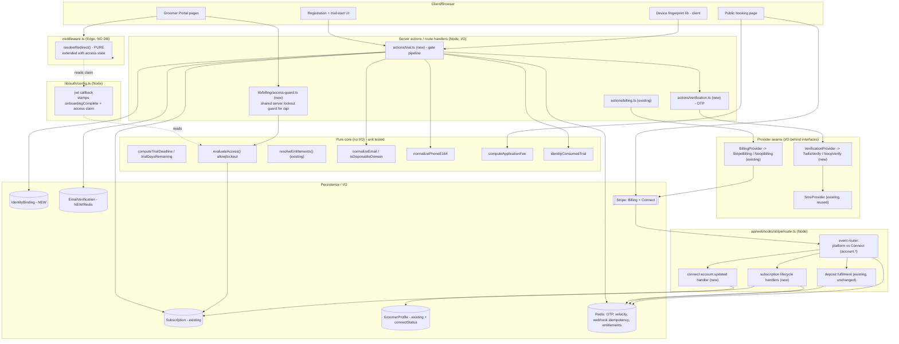
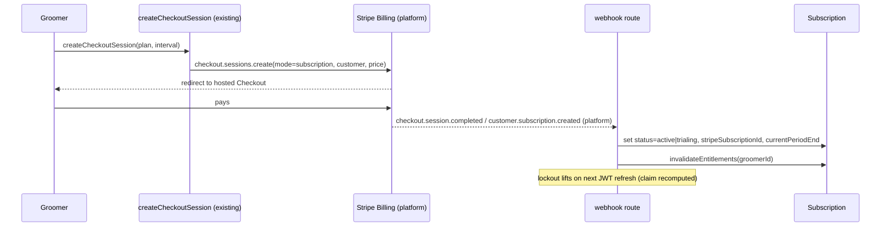
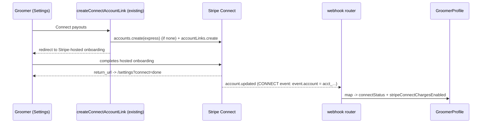
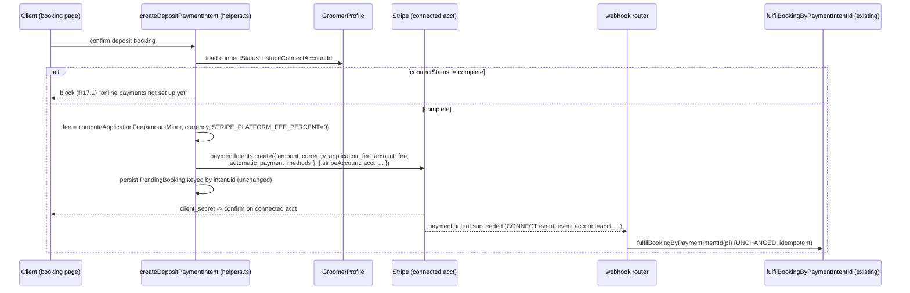

# Design Document — Billing, Trial, and Payments

## Overview

This feature delivers Pawxis's launch-critical money surface as **three cooperating systems that share one set of seams** already present in the codebase. Nothing here introduces a parallel stack: every third party stays behind the existing provider pattern, every money move stays idempotent and webhook-driven, and every capability degrades to a labelled "not configured" state rather than crashing.

The three systems and how they connect:

1. **Trial → hard lockout → auto-renewal (Pawxis revenue).** A groomer starts a 14-day no-card trial. The trial state lives on the existing `Subscription` model and is resolved by the existing pure `resolveEntitlements` core. A new pure `evaluateAccess` function turns that same subscription state into an **allow / lockout** decision. That decision is stamped onto the NextAuth JWT (alongside the existing `onboardingComplete` claim) so the existing `resolveRedirect` middleware can enforce the hard lockout **without a per-request DB call**. Stripe Billing drives subscribe/renew/cancel; the existing webhook route gains subscription-event handling.

2. **No-card trial abuse prevention.** Before a trial is provisioned, a registrant passes an **ordered gate pipeline** (email normalize → disposable-domain check → email verification → phone OTP → device/IP velocity → identity-binding check). The pipeline is built from pure decision functions plus a new `VerificationProvider` seam (phone OTP) that mirrors the existing `BillingProvider`/`SmsProvider` seams and reuses the existing Twilio-backed SMS seam. Trials bind to a **verified phone identity** persisted in a new `IdentityBinding` collection that survives account deletion, so re-registration cannot farm trials.

3. **Client → groomer deposits via Stripe Connect Express (direct charges).** The existing deposit `PaymentIntent` creation (`src/lib/stripe/helpers.ts`) is extended to create the charge **directly on the groomer's connected account** (`Stripe-Account` header), with `application_fee_amount` derived from a pure `computeApplicationFee` function configured to **0** at launch. The existing idempotent fulfilment core (`fulfilBookingByPaymentIntentId`) is reused unchanged; the webhook route learns to route **Connect (account) events** separately from platform events while leaving existing deposit fulfilment intact.

### High-level data flow

```
Registrant ──► Abuse pipeline (pure gates + VerificationProvider) ──► provision Trial
                                     │
                                     ▼
                             IdentityBinding (persisted, survives deletion)
                                     │
          Subscription (trialing) ◄──┘
                 │
   resolveEntitlements (pure)      evaluateAccess (pure)  ──► JWT claim ──► middleware lockout gate
                 │                                                              │
                 ▼                                                              ▼
     Portal feature gating                                        redirect to /billing when locked

Groomer ──► Stripe Billing Checkout ──► webhook (platform) ──► Subscription=active ──► lockout lifted
Groomer ──► Connect Express onboarding ──► webhook (account.updated) ──► connectStatus + chargesEnabled
Client  ──► deposit (DIRECT charge on connected acct, fee=0) ──► webhook (platform PI) ──► existing fulfilment
```

The whole design keeps **business logic in pure, injectable functions** (trial math, lockout decision, email/phone normalization, fee computation, identity-binding decision) separated from all I/O (Mongoose, Stripe, Redis, Twilio), matching how `resolveRedirect`, `resolveEntitlements`, `calculateEstimate`, and `hasFeature` are already structured and unit-tested with vitest + fast-check.

---

## Architecture

### Component diagram



### What is pure vs I/O

| Pure (no I/O, directly unit-testable) | I/O (adapters around the pure core) |
| --- | --- |
| `computeTrialDeadline`, `trialDaysRemaining` | `actions/trial.ts` (orchestrates gates, writes DB/Redis) |
| `evaluateAccess` (lockout decision) | `actions/verification.ts` (calls VerificationProvider) |
| `resolveEntitlements` (existing) | `StripeBilling`, `TwilioVerify` provider impls |
| `normalizeEmail`, `isDisposableDomain` | webhook route handlers (verify, route, persist) |
| `normalizePhoneE164` | `access-guard.ts` (reads Subscription, calls `evaluateAccess`) |
| `computeApplicationFee` | `jwt` callback (reads DB, stamps claim) |
| `identityConsumedTrial` | fingerprint collection (browser), velocity counters (Redis) |
| `resolveRedirect` (existing, extended) | middleware wiring (`NextResponse`) |

### Key architectural rules preserved

- **No DB in middleware.** Lockout state reaches the middleware only through a JWT claim stamped by the `jwt` callback (Node runtime, which may touch the DB). `resolveRedirect` stays pure.
- **No-self-redirect invariant.** The extended `resolveRedirect` continues to never return a path equal to the current one.
- **Never-throw envelopes.** New providers and actions return typed `{ ok }` results exactly like `BillingResult`.
- **Not-configured is a first-class state.** `isSet()`-style placeholder handling (as in `provider.ts` and `auth/config.ts`) applies to all new env vars.
- **One fulfilment path.** Connect direct-charge deposits reuse `fulfilBookingByPaymentIntentId` — no second commit path.

---

## Components and Interfaces

### New provider seam — `VerificationProvider` (`src/lib/verification/provider.ts`)

Mirrors `BillingProvider`/`SmsProvider`: interface + `getVerificationProvider()` factory returning a real impl when configured, else a `NoopVerificationProvider`. Never throws; returns typed envelopes.

```ts
export type VerifyFailureReason =
  | 'not_configured' | 'provider_unavailable' | 'invalid_code'
  | 'expired' | 'rate_limited';

export type VerifyStartResult =
  | { ok: true; channel: 'sms'; expiresInSec: number }
  | { ok: false; reason: VerifyFailureReason; message: string };

export type VerifyCheckResult =
  | { ok: true; verified: true }
  | { ok: false; reason: VerifyFailureReason; message: string };

export interface VerificationProvider {
  /** Send an OTP to a normalized E.164 phone (Req 10.2). */
  startPhoneVerification(params: { phoneE164: string }): Promise<VerifyStartResult>;
  /** Check a submitted code against the active challenge (Req 10.3/10.4). */
  checkPhoneVerification(params: { phoneE164: string; code: string }): Promise<VerifyCheckResult>;
}

export function isVerificationConfigured(): boolean; // placeholder-aware (Req 13.1, 19.4)
export function getVerificationProvider(): VerificationProvider;
```

Two implementations:
- `TwilioVerifyProvider` — preferred, uses **Twilio Verify** (Stripe-equivalent hosted OTP: no local code storage, provider manages expiry/rate limits). Noted as the default but kept **behind the interface** per the brief, reusing the existing Twilio dependency.
- `OtpSmsProvider` (fallback/alternative) — generates a code, stores it in Redis (`otp:{phoneHash}`), and sends it through the **existing `SmsProvider`** (`sendSms`, `kind: 'reply'`-style transactional). This keeps a path that works with just the existing SMS vendor and no Twilio Verify service SID.

`getVerificationProvider()` returns `TwilioVerifyProvider` when `TWILIO_VERIFY_SERVICE_SID` is set, else `OtpSmsProvider` when SMS is configured (`isSmsConfigured()`), else `NoopVerificationProvider`.

### New server actions

- `src/actions/trial.ts` — `startTrialGated(input)`: runs the full abuse pipeline then provisions the trial (writes `Subscription` + `IdentityBinding`), delegating the actual Stripe trial recording to the existing `BillingProvider.startTrial`. Returns a typed envelope.
- `src/actions/verification.ts` — `requestPhoneOtp({ phone })` and `confirmPhoneOtp({ phone, code })`, both scoped to `session.user.id`, both delegating to `VerificationProvider` and the velocity/rate-limit layer.
- Email verification: `requestEmailVerification()` / `confirmEmailVerification(token)` reuse the existing Resend email seam (`@/lib/email/send`) to send a tokened link.

### New shared guard — `src/lib/billing/access-guard.ts`

```ts
/** Server-side lockout guard for /api routes & server actions (middleware
 *  can't see /api — matcher excludes it). Loads the subscription (cached via
 *  the existing entitlements Redis cache) and applies the PURE evaluateAccess. */
export async function assertPortalAccess(groomerId: string): Promise<AccessDecision>;
export class PortalLockedError extends AppError {} // 402/403 -> callers map to upgrade prompt
```

### Extended existing components

- `src/lib/billing/provider.ts` — `BillingProvider` gains an optional `createConnectDepositIntent` concept is **not** added here; the deposit intent stays in `lib/stripe/helpers.ts` where it already lives, extended for direct charges (see Stripe flows). No breaking signature changes.
- `src/app/api/webhooks/stripe/route.ts` — add subscription + account event routing (below).
- `src/middleware.ts` — extend `resolveRedirect` signature (below).
- `src/lib/auth/config.ts` — stamp the access claim in the `jwt` callback (below).
- `src/lib/db/models/subscription.ts` — add `pastDueSince`, `trialStartedAt`, `trialDeadline` (below).
- `src/lib/db/models/groomer-profile.ts` — add `connectStatus` enum (below).

---

## Data Models

### Decision — reuse the existing `Subscription` model (do NOT add profile fields, do NOT add a second model)

**Recommendation: extend the existing `Subscription` collection.** The brief framed this as "new fields on GroomerProfile OR a new Subscription model", but the codebase **already has `src/lib/db/models/subscription.ts`** — one row per groomer, unique on `groomerId`, already carrying `status` (`trialing|active|past_due|canceled|expired`), `trialEndsAt`, `currentPeriodEnd`, `stripeCustomerId`, `stripeSubscriptionId`, and already consumed by the pure `resolveEntitlements` core and the Stripe billing impl.

Justification:
- **No parallel structure.** Adding fields to `GroomerProfile` would split billing state across two collections and bypass the entitlements cache. A second `Subscription`-like model would duplicate what exists.
- **Separation of concerns.** Billing lifecycle churns independently of business config (branding, availability). Keeping it in its own collection keeps `GroomerProfile` stable and lets the 60s entitlements cache stay keyed to one row.
- **Already wired.** Webhooks, `ensureCustomer`, and entitlements all read this row.

The requirement's `none` status maps to **"no Subscription row"** — the entitlements layer already treats a missing row as a fresh trial, so we keep that semantics and never persist a literal `none`.

**Additive fields** on `ISubscription` / `subscriptionSchema`:

| Field | Type | Purpose | Requirement |
| --- | --- | --- | --- |
| `trialStartedAt` | `Date \| null` | Trial start timestamp (anchor for the deadline). | R1.1 |
| `trialDeadline` | `Date \| null` | **Stored** computed deadline = noon in groomer tz on day 14. Stored (not only computed) so middleware/guard read it without recomputation and timezone need not be re-fetched per check. | R1.2, R3.1 |
| `pastDueSince` | `Date \| null` | When the subscription first went `past_due` (grace-window anchor independent of `currentPeriodEnd`). | R5.4 |

`trialEndsAt` is retained for backward compatibility with `resolveEntitlements`; new code writes both `trialEndsAt` and `trialDeadline` to the same instant (noon-in-tz on day 14) so the two never drift. `currentPeriodEnd`, `stripeCustomerId`, `stripeSubscriptionId` already exist.

### New collection — `IdentityBinding` (`src/lib/db/models/identity-binding.ts`)

Persists **independently of the account/profile** so deleting a `User`/`GroomerProfile` does **not** remove the binding (R11.4). This is the anti-abuse ledger.

```ts
export interface IIdentityBinding {
  _id: Types.ObjectId;
  /** Canonical normalized email (per R9) — lowercased, Gmail-collapsed. Stored for identity match. */
  normalizedEmail: string;
  /** SHA-256 of the canonical E.164 phone (see PII note). Primary identity key (R11.1-11.3). */
  phoneHash: string;
  /** When this identity first consumed a trial. */
  firstTrialAt: Date;
  /** Optional expiry for phone recycling (refined R11): binding is "consumed"
   *  only while now < bindingExpiresAt; null = never expires. */
  bindingExpiresAt?: Date | null;
  /** Non-PII device fingerprints seen for this identity (R12.1, R12.4). */
  deviceFingerprints: string[];
  /** Originating IPs (truncated/last-octet-masked, see PII note). */
  ips: string[];
  createdAt: Date;
  updatedAt: Date;
}
```

Indexes: unique on `phoneHash` (the authoritative identity key), secondary index on `normalizedEmail`. `bindingExpiresAt` optionally TTL-indexed if we want automatic phone-recycling cleanup (off by default; `identityConsumedTrial` handles expiry logically regardless).

**PII handling (R19, Security section):**
- **Phone — hash it.** Store `phoneHash = sha256(canonicalE164 + PEPPER)` with a server-only pepper env, not the raw number. We only ever need equality checks ("has this phone consumed a trial?"), never the plaintext back. This keeps the abuse ledger from being a plaintext phone directory if the collection leaks.
- **Email — store normalized plaintext.** We need the normalized email for operator review and cross-referencing, and it is lower-sensitivity than phone; store the canonical normalized form (not the raw display email, which stays on the `User`).
- **IP — mask.** Store with the last octet (IPv4) / low bits (IPv6) zeroed to keep it a coarse velocity signal rather than precise tracking (R12.4 "non-PII signal" spirit).
- **Device fingerprint — opaque hash only** (R12.4), never raw UA/entropy components.

### OTP + velocity storage — **Redis-backed (recommended)**

**Recommendation: Redis, not a persisted collection**, reusing `src/lib/redis.ts`.

| Concern | Key | TTL | Notes |
| --- | --- | --- | --- |
| Phone OTP (only for the `OtpSmsProvider` fallback; Twilio Verify stores its own) | `otp:{phoneHash}` → `{ codeHash, attempts }` | ~10 min | code stored hashed; `attempts` increments on wrong code (R10.4) |
| OTP resend rate limit | `otp:rl:{phoneHash}` | window | configurable per R10.4 |
| Device velocity counter | `vel:dev:{fingerprint}` | 24 h (configurable) | `INCR`+`EXPIRE`; threshold >3 flags (R12.2/12.3) |
| IP velocity counter | `vel:ip:{maskedIp}` | 24 h (configurable) | same |
| Email verification token | `evf:{token}` → `{ normalizedEmail }` | ~30 min | if we prefer not to persist; alternative `EmailVerification` collection noted below |
| Webhook idempotency (existing) | `idem:stripe:{eventId}` | 7 d | reuse `idempotencyOnce` |

Rationale: OTP codes and velocity windows are **short-lived, high-churn, and must fail-open** when the store is down — exactly Redis's role here (and the hold/idempotency/entitlement precedent). The **durable** fact we must never lose is the `IdentityBinding` (Mongo). Velocity being transient and best-effort matches R12.5 (missing signals must not block). New key builders + TTLs are added to the `keys`/`TTL` maps in `redis.ts`.

Email verification can be token-in-Redis (above) **or** a small `EmailVerification` collection if we want verified-email history for audit. **Recommendation:** keep the verified flag on the `User` (`emailVerifiedAt`) plus a Redis token for the in-flight challenge — minimal new surface, and the canonical normalized email + verified state is also captured on the `IdentityBinding` at provisioning (R7.4, R11.1).

### `GroomerProfile` — add `connectStatus` enum (distinct from the boolean)

The profile already has `stripeConnectAccountId` and `stripeConnectChargesEnabled: boolean`. Add a richer enum for the five surfaced states (R15.1) while keeping the boolean as the fast "can I charge?" flag:

```ts
export type ConnectStatus =
  | 'not_started' | 'pending' | 'needs_info' | 'complete' | 'disabled';
// schema: connectStatus: { type: String, enum: [...], default: 'not_started' }
```

`account.updated` maps Stripe's `charges_enabled` / `details_submitted` / `requirements` into this enum **and** keeps `stripeConnectChargesEnabled` in sync (R15.4). `connectStatus === 'complete'` is the gate for deposit-requiring bookings (R16.1, R17).

---

## Pure Functions

All live under `src/lib/billing/` and `src/lib/identity/`, import nothing from Mongoose/Stripe/Redis, take `now`/config as explicit args, and are unit-tested directly.

### `src/lib/billing/trial.ts`

```ts
/** The precise trial deadline: noon (12:00) in the groomer's tz on the 14th
 *  day after start (R1.2). Uses date-fns-tz (already a dependency). Returns a
 *  UTC Date. Pure: (startedAt, tz) -> Date. */
export function computeTrialDeadline(startedAt: Date, timezone: string): Date;

/** Whole trial days remaining until the deadline, relative to `now` in the
 *  groomer's tz (R2.1-2.4). Never negative: returns 0 once the deadline has
 *  passed (R2.4). Pure: (now, deadline, tz) -> number >= 0. */
export function trialDaysRemaining(now: Date, deadline: Date, timezone: string): number;
```

### `src/lib/billing/access.ts`

```ts
export type AccessState = 'trialing' | 'active' | 'past_due' | 'canceled' | 'none';
export interface AccessInput {
  status: AccessState;
  trialDeadline: Date | null;
  pastDueSince: Date | null;
  now: Date;
}
export type AccessDecision = { allow: true } | { allow: false; reason: 'trial_expired' | 'inactive' };

/** The lockout decision (R3). PURE and consumed by BOTH the middleware (via the
 *  JWT claim derived from it) and the server access-guard. Rules:
 *   - active                       -> allow
 *   - trialing & now < deadline    -> allow
 *   - trialing & now >= deadline   -> lockout (trial_expired)
 *   - past_due & within grace      -> allow (grace = GRACE_PERIOD_DAYS from pastDueSince)
 *   - past_due beyond grace        -> lockout (inactive)
 *   - canceled | none              -> lockout (inactive)
 *  Monotonic in time: once it returns lockout for a given input at time t, it
 *  returns lockout for every t' > t. */
export function evaluateAccess(input: AccessInput): AccessDecision;

/** Compact claim stamped on the JWT so middleware needs no DB. */
export interface AccessClaim { st: AccessState; dl: number | null; pd: number | null; }
export function toAccessClaim(sub: AccessInput): AccessClaim;      // for the jwt callback
export function accessFromClaim(claim: AccessClaim, now: Date): AccessDecision; // for middleware
```

`evaluateAccess` reuses the same grace semantics as the existing `resolveEntitlements` (`GRACE_PERIOD_DAYS`), so lockout and feature-gating never disagree.

### `src/lib/identity/email.ts`

```ts
/** Canonical email (R9). Lowercase; for Gmail-equivalent domains
 *  (gmail.com, googlemail.com) remove dots in the local part and drop any
 *  "+tag" suffix. Non-Gmail domains: lowercase + trim only. IDEMPOTENT:
 *  normalizeEmail(normalizeEmail(x)) === normalizeEmail(x). Pure. */
export function normalizeEmail(email: string): string;

/** Whether the domain is on the disposable blocklist (R8). Pure over an
 *  injected Set<string> so the loader (file/remote) is a separate I/O concern;
 *  a load failure is handled by the caller as fail-open (R8.4). */
export function isDisposableDomain(domain: string, blocklist: ReadonlySet<string>): boolean;
```

### `src/lib/identity/phone.ts`

```ts
/** Canonical E.164 phone (R10.5). Strips formatting, applies defaultRegion for
 *  national-format inputs. Returns null when not a plausible phone. Pure.
 *  (Thin wrapper over a small libphonenumber-style normalizer kept pure/testable.) */
export function normalizePhoneE164(input: string, defaultRegion: string): string | null;
```

### `src/lib/billing/fees.ts`

```ts
/** Application fee for a direct charge (R16.2). Zero-decimal-currency aware
 *  (jpy/krw have no minor unit). Rate is a percent in [0,100]; launch default 0.
 *  INVARIANTS: result is an integer in minor units, 0 <= fee <= amountMinor for
 *  any rate in [0,100] and any supported currency. Pure. */
export function computeApplicationFee(
  amountMinor: number, currency: string, ratePercent: number
): number;
```

### `src/lib/identity/binding.ts`

```ts
export interface BindingView { firstTrialAt: Date; bindingExpiresAt?: Date | null; }
/** Whether this identity has ALREADY consumed its trial as of `now` (R11.2/11.3).
 *  True when a binding exists AND (bindingExpiresAt is null OR now < bindingExpiresAt).
 *  Once bindingExpiresAt has passed, the phone is "recycled" and may trial again
 *  (refined R11). Pure: (binding|null, now) -> boolean. */
export function identityConsumedTrial(binding: BindingView | null, now: Date): boolean;
```

---

## Stripe Flows

All sequences assume signature-verified events; idempotency is noted per flow. "Platform event" = delivered with no `account` field (Pawxis platform account). "Connect event" = delivered with a top-level `event.account` (the connected account id) — this is exactly how the webhook route distinguishes them (below).

### (a) Start no-card trial

```mermaid
sequenceDiagram
    participant G as Groomer (browser)
    participant A as actions/trial.ts (pipeline)
    participant B as BillingProvider.startTrial
    participant DB as Subscription + IdentityBinding
    G->>A: startTrialGated(input) (after all gates pass)
    A->>A: computeTrialDeadline(now, tz)
    A->>DB: upsert Subscription {status:trialing, trialStartedAt, trialDeadline, trialEndsAt}
    A->>DB: insert IdentityBinding {phoneHash, normalizedEmail, firstTrialAt}
    A->>B: startTrial() (records local trialing; NO card, no Stripe sub yet)
    B-->>A: { ok:true, url:/billing?trial=started }
    A-->>G: ok -> redirect
```

No Stripe object is created at trial start (no card, R1.3); the local `Subscription` is authoritative until the groomer subscribes. **Idempotency:** `IdentityBinding` unique `phoneHash` makes a double-submit a no-op (second insert hits duplicate-key → treated as "already consumed", R1.4/R11.2). Works even when Stripe Billing is in Not_Configured_State (R1.5) because trial recording is local.

### (b) Subscribe checkout → webhook → active



Reuses the existing `createCheckout` in `StripeBilling` unchanged. **Idempotency:** `idempotencyOnce(event.id)` fast-path + the `Subscription` upsert is naturally idempotent (set-to-state). (R4.1, R4.2, R3.4)

### (c) Subscription lifecycle webhooks → local status

```mermaid
sequenceDiagram
    participant S as Stripe Billing
    participant W as webhook router
    participant DB as Subscription
    S-->>W: customer.subscription.updated / .deleted
    W->>DB: map Stripe status -> local {active|past_due|canceled}; set currentPeriodEnd
    S-->>W: invoice.paid
    W->>DB: status=active; currentPeriodEnd=period_end; clear pastDueSince
    S-->>W: invoice.payment_failed
    W->>DB: status=past_due; pastDueSince = now (if not already set)
    S-->>W: customer.subscription.trial_will_end
    W->>DB: record trial-ending flag (for countdown/notification)
    W->>DB: invalidateEntitlements(groomerId) on every change
```

Lookup is by `stripeSubscriptionId` / `stripeCustomerId` (both already indexed, sparse). Status mapping is a small pure helper `mapStripeSubStatus(stripeStatus) -> SubscriptionStatus`. **Idempotency:** event-id fast-path; all writes are state-sets (R5.2–5.6). Transient failures return **5xx so Stripe retries** (R5.7). Webhook state is source of truth (R5.8).

### (d) Connect Express onboarding (account link → return → account.updated)



On return we also optimistically refresh via `accounts.retrieve` (so the UI updates without waiting for the webhook), but `account.updated` is authoritative (R15.4). **Idempotency:** status mapping is a pure function of the account object; repeated events converge to the same stored status (R15.5). Guarded by `isConnectConfigured()` (R14.6).

### (e) Client deposit as a DIRECT charge on the connected account → webhook fulfilment

Modification point: `createDepositPaymentIntent` in `src/lib/stripe/helpers.ts`.



**Direct-charge semantics:** the `PaymentIntent` is created **on the connected account** via `{ stripeAccount: acct_... }` (the `Stripe-Account` header), so funds settle in the groomer's balance — Pawxis is not the MoR (R16.4). `application_fee_amount` is included and routes the fee to the platform; at launch `STRIPE_PLATFORM_FEE_PERCENT=0` ⇒ fee `0` ⇒ plumbing present, nothing taken (R16.2). We use direct charges (not `on_behalf_of` + separate transfer) because the funds should land directly on the groomer's balance; `on_behalf_of`/`transfer_data` is the destination-charge pattern and is explicitly **not** chosen. **Idempotency:** unchanged — the `Transaction` unique index on `stripePaymentId` plus the webhook event-id fast-path guarantee at-most-once fulfilment (R16.3, R16.5).

### How the webhook route distinguishes & routes platform vs Connect events

Stripe sends **Connect** events with a top-level `event.account` (the `acct_...` id); **platform** events have none. The route will:

1. Verify the signature. Connect events are signed with the **same endpoint secret** when using a single Connect webhook endpoint; if separate endpoints/secrets are configured (`STRIPE_WEBHOOK_SECRET` for platform, `STRIPE_CONNECT_WEBHOOK_SECRET` for Connect) the route tries the matching secret. We keep **one endpoint** by default and verify with `STRIPE_WEBHOOK_SECRET`, falling back to the Connect secret only if configured and the first verification fails (R6.1, R6.2).
2. `idempotencyOnce(event.id)` fast-path (unchanged).
3. Route by `event.type` **and** presence of `event.account`:
   - `payment_intent.succeeded` / `payment_intent.payment_failed` → **existing deposit handlers, unchanged** (these now arrive as Connect events for direct-charge deposits; `fulfilBookingByPaymentIntentId` keys off the PI id regardless of account, so no change is needed) (R6.3).
   - `account.updated` (Connect) → new `handleAccountUpdated(event.account, account)`.
   - `customer.subscription.*`, `invoice.paid`, `invoice.payment_failed`, `customer.subscription.trial_will_end` (platform) → new subscription handlers.
   - default → acknowledged 200 (unchanged).

Secrets and full payloads are never logged (R6.4, R19.3).

---

## Correctness Properties

*A property is a characteristic or behavior that should hold true across all valid executions of a system — essentially, a formal statement about what the system should do. Properties serve as the bridge between human-readable specifications and machine-verifiable correctness guarantees.*

These properties target the **pure core** (fee math, trial math, access decision, email/phone normalization, identity binding, status mappings, routing invariants). All are implemented as single property-based tests using **fast-check** (already a dev dependency), minimum **100 iterations** each, tagged `Feature: billing-trial-and-payments, Property N: ...`.

### Property 1: Application fee is bounded, integer, zero-at-zero, and monotonic

*For any* non-negative integer `amountMinor`, *any* supported currency (including zero-decimal currencies such as `jpy`/`krw`), and *any* `ratePercent` in `[0, 100]`, `computeApplicationFee(amountMinor, currency, ratePercent)` returns an integer `fee` such that `0 <= fee <= amountMinor`; `fee === 0` when `ratePercent === 0`; and `fee` is non-decreasing in `ratePercent`.

**Validates: Requirements 16.2**

### Property 2: Trial deadline is noon in the groomer's timezone on day 14

*For any* start instant and *any* IANA timezone from the supported set, `computeTrialDeadline(startedAt, timezone)` returns an instant whose **local** wall-clock time in that timezone is 12:00 and whose local date is the start's local date plus 14 days.

**Validates: Requirements 1.2**

### Property 3: Trial days remaining is non-negative and monotonic non-increasing in time

*For any* `deadline`, timezone, and times `now1 <= now2`, `trialDaysRemaining` returns a value `>= 0` for both, returns `0` whenever `now >= deadline`, and satisfies `trialDaysRemaining(now2, …) <= trialDaysRemaining(now1, …)`.

**Validates: Requirements 2.1, 2.2, 2.4**

### Property 4: Access decision follows the state machine and is monotonic in time

*For any* `AccessInput` (`status`, `trialDeadline`, `pastDueSince`, `now`), `evaluateAccess` returns `allow` exactly when the account is `active`, or `trialing` with `now < trialDeadline`, or `past_due` within the grace window; and returns `lockout` otherwise (`canceled`, `none`, expired trial, or past grace). Furthermore it is **monotonic in time**: if it returns `lockout` for some `now = t`, it returns `lockout` for every `now = t' > t` with the same other fields.

**Validates: Requirements 3.1, 3.3, 3.4**

### Property 5: Middleware never redirects a request to its own path (no-self-redirect)

*For any* `pathname`, authentication flag, onboarding flag, and access claim, the extended `resolveRedirect(...)` either returns `null` or returns a path **not equal** to `pathname`. In particular, a locked groomer already on `/billing` (the Upgrade_Page) or on an auth route is never redirected away by the lockout gate.

**Validates: Requirements 3.2, 3.5**

### Property 6: `normalizeEmail` is idempotent

*For any* input email string, `normalizeEmail(normalizeEmail(email)) === normalizeEmail(email)`.

**Validates: Requirements 9 (normalization stability)**

### Property 7: Gmail aliases collapse to one canonical identity

*For any* Gmail-equivalent mailbox local part, inserting dots anywhere in the local part and/or appending a `+tag` suffix does not change the result of `normalizeEmail`; consequently two addresses that differ only by Gmail dots/tags produce the **same** canonical email.

**Validates: Requirements 9.1, 9.3**

### Property 8: Disposable-domain check matches blocklist membership on the normalized domain

*For any* domain string and *any* blocklist `Set`, `isDisposableDomain(domain, blocklist)` returns `true` **iff** the (lowercased) domain is a member of the blocklist, and the domain used is the one extracted from the **normalized** email.

**Validates: Requirements 8.1, 8.3**

### Property 9: Phone canonicalization is format-invariant and idempotent

*For any* valid base phone number, all formatting variants (spaces, dashes, parentheses, leading `+`/`00`, national vs international) normalize via `normalizePhoneE164` to the **same** E.164 string; and `normalizePhoneE164` is idempotent on an already-canonical E.164 input.

**Validates: Requirements 10.5**

### Property 10: Identity consumed-trial respects the expiry boundary

*For any* `binding` (or `null`) and *any* `now`, `identityConsumedTrial(binding, now)` returns `true` iff a binding exists **and** (`bindingExpiresAt` is null **or** `now < bindingExpiresAt`); it returns `false` for a `null` binding and for `now >= bindingExpiresAt` (phone recycled).

**Validates: Requirements 11.2, 11.3**

### Property 11: Stripe subscription-status mapping is total and lands in the local enum

*For any* Stripe subscription status string, `mapStripeSubStatus` returns a value within `{trialing, active, past_due, canceled, expired}`; `invoice.payment_failed` yields `past_due`; `invoice.paid` yields `active`.

**Validates: Requirements 5.2, 5.3, 5.4**

### Property 12: Subscription lifecycle handling is idempotent / confluent over duplicate events

*For any* sequence of subscription lifecycle events containing arbitrary duplicates, applying the sequence to a `Subscription` yields the **same** final status/period state as applying the duplicate-free sequence (processing each distinct event at most once).

**Validates: Requirements 5.6, 16.5**

### Property 13: Connect status mapping is total, consistent, and idempotent

*For any* Stripe account object (`charges_enabled`, `details_submitted`, `requirements`), `mapConnectStatus` returns a value in `{not_started, pending, needs_info, complete, disabled}`; `complete` holds iff `charges_enabled` is true; and applying the same account object twice yields the same stored `connectStatus` and `stripeConnectChargesEnabled`.

**Validates: Requirements 15.1, 15.4, 15.5**

### Property 14: Deposit-booking permission depends only on deposit requirement and Connect completeness

*For any* `requiresDeposit` flag and *any* `connectStatus`, `bookingAllowed(requiresDeposit, connectStatus)` returns `true` iff `requiresDeposit === false` **or** `connectStatus === 'complete'`.

**Validates: Requirements 17.2, 17.3**

### Property 15: Velocity flagging triggers above the threshold without blocking

*For any* non-negative `count` and configurable `threshold`, `shouldFlagVelocity(count, threshold)` returns `true` iff `count > threshold`; and under the default policy a flagged attempt is still permitted to proceed (returns `allow` with `flagged: true`).

**Validates: Requirements 12.2, 12.3**

### Property 16: Placeholder configuration is treated as not-configured

*For any* env-value string, the shared `isSet` classifier returns `false` for empty/whitespace values and for shipped placeholder shapes (`…replace_me`, `your-…`, `price_replace…`), and `true` for any other non-empty value.

**Validates: Requirements 19.4**

---

## Middleware Lockout Integration

### Extended `resolveRedirect` signature

The pure function gains one optional input — the access decision derived from the JWT claim — and one new rule that runs **after** the auth/onboarding rules so the existing invariants are untouched:

```ts
export function resolveRedirect(params: {
  pathname: string;
  isAuthenticated: boolean;
  onboardingComplete: boolean | undefined;
  access?: AccessDecision;            // NEW: allow|lockout, derived from the JWT claim
}): string | null;
```

New rule (added last, before `return null`):

```
// Hard lockout: an authenticated, onboarded groomer whose access is "lockout"
// may only reach the Upgrade_Page (/billing) and auth routes; everything else
// in the portal redirects to /billing. The existing no-self-redirect guard is
// reused verbatim.
if (isAuthenticated && onboardingComplete && access && !access.allow) {
  if (isAuthRoute(pathname)) return null;                 // sign out / switch acct
  if (pathname === '/billing' || pathname.startsWith('/billing/')) return null; // Upgrade_Page reachable (R3.2)
  if (isPortalRoute(pathname)) return pathname === '/billing' ? null : '/billing'; // R3.1, R3.3
}
```

The function still **never returns a path equal to `pathname`** (Property 5 / R3.5). Public routes (`/book`, marketing) are not portal routes, so they pass through — a locked groomer's Public_Booking_Page stays up for clients (R3.6).

### New JWT claim(s) and how freshness is handled without a per-request DB call

The `jwt` callback (Node runtime) stamps a compact **access claim** derived from the pure `toAccessClaim`:

```ts
token.access = { st, dl, pd }; // status, trialDeadline(ms|null), pastDueSince(ms|null)
```

Middleware recomputes the decision locally with `accessFromClaim(token.access, new Date())` — **no DB, no Stripe** in the middleware. Freshness strategy, mirroring the existing `onboardingComplete` refresh logic:

- **Refresh triggers:** at sign-in; on explicit `trigger === 'update'` (we call NextAuth `update()` right after a successful checkout and after a webhook-driven change the user is viewing); and on a short **time-based refresh** — the callback restamps the claim when the token's last access-refresh is older than a small TTL (e.g. 5 min) so a webhook flip to `active`/`past_due` propagates within one refresh window even without an explicit update.
- **Why this is safe:** the claim stores the **deadline and pastDueSince instants**, not a precomputed boolean, so the *expiry* edge (trial crossing noon, grace crossing its window) is evaluated against the **live clock in the middleware** every request. Only a *status change driven by Stripe* (e.g. `trialing → active`) needs a refresh; the time-based crossing is always exact without one. This means the common lockout trigger (trial simply running out) needs **zero** refresh to be enforced on time.
- A missing/old claim is treated as `allow` for `active`-less safety only after onboarding, and defensively never locks a user who has no resolvable billing state yet (fail-open to the entitlements default trial), consistent with the entitlements layer's "transient outage never wrongly locks out" stance.

### API-route behavior (matcher excludes `/api`)

The middleware matcher excludes `/api`, so middleware **cannot** gate API routes or server actions. Per refined **R3.5**, API/mutation lockout is enforced by a **shared server guard**, not middleware:

- `assertPortalAccess(groomerId)` in `src/lib/billing/access-guard.ts` loads the subscription (via the existing entitlements Redis cache to avoid a DB hit on the hot path) and applies the **same pure `evaluateAccess`**. It throws `PortalLockedError` (mapped to 402/403) which API route handlers and portal-mutating server actions call at their top. Because it shares the pure decision function with the middleware, UI redirect and API enforcement can never disagree.

---

## Abuse-Prevention Pipeline

Ordered gate sequence in `src/actions/trial.ts :: startTrialGated`. Each gate returns a typed envelope; the pipeline short-circuits on the first fail-closed stop.

| # | Gate | Pure/I/O | Fail policy | Requirement |
| --- | --- | --- | --- | --- |
| 1 | **Normalize email** (`normalizeEmail`) | pure | n/a (always runs) | R9 |
| 2 | **Disposable-domain check** (`isDisposableDomain` over a loaded `Set`) | pure (loader is I/O) | **fail-OPEN** if the blocklist can't load — allow + log diagnostic | R8.1, R8.3, **R8.4** |
| 3 | **Email verification** (token link via Resend; `User.emailVerifiedAt`) | I/O | **fail-CLOSED** — no trial until verified (withhold entitlement) | R7.1, R7.2, R7.3 |
| 4 | **Phone OTP** (`VerificationProvider.start/check`; `normalizePhoneE164`) | I/O + pure | **fail-CLOSED on wrong/expired code**; **degraded (fail-open-ish)** when the provider is *down/unconfigured* — labelled Not_Configured_State, user-safe retry, never permanently blocks (R13) | R10.1–10.5, R13.2, R13.3 |
| 5 | **Velocity / device check** (`shouldFlagVelocity` over Redis counters) | pure decision + I/O counters | **fail-OPEN** — flag-not-block by default (>3/24h configurable); signal-collection failure proceeds | R12.1–12.5 |
| 6 | **Identity-binding check** (`identityConsumedTrial` over `IdentityBinding`) | pure decision + I/O load | **fail-CLOSED** — if this phone identity already consumed a trial, decline | R11.1–11.4, R1.4 |
| 7 | **Provision trial** (write `Subscription` trialing + insert `IdentityBinding`; call `BillingProvider.startTrial`) | I/O | — | R1.1–1.3, R1.5 |

Ordering rationale: cheap pure checks first (email normalize/disposable), then the two hard identity gates (email, phone) that bind the trial, then velocity (soft/advisory), then the authoritative binding check immediately before provisioning so a race between two near-simultaneous starts is resolved by the unique `phoneHash` index at write time (the loser is treated as "already consumed").

**Device fingerprint collection:** a small **client** lib (`src/lib/identity/fingerprint.client.ts`) computes an opaque, non-PII hash from stable-ish browser signals and submits it with the trial-start request; the server stores only the hash on the `IdentityBinding` and increments `vel:dev:{fingerprint}` (R12.1, R12.4). If the client omits it (blocked/unsupported), the pipeline proceeds (R12.5).

---

## Configuration / Environment

All values are **placeholder-aware** via the shared `isSet` classifier (empty/`…replace_me`/`your-…`/`price_replace…` ⇒ Not_Configured_State), per R19.4.

| Env var | Purpose | Default / notes |
| --- | --- | --- |
| `STRIPE_SECRET_KEY` | Platform Stripe key (existing) | required for any Stripe capability |
| `STRIPE_WEBHOOK_SECRET` | Platform + Connect webhook signature (existing) | single-endpoint default |
| `STRIPE_CONNECT_WEBHOOK_SECRET` | *Optional* separate Connect endpoint secret | only if a second endpoint is configured |
| `STRIPE_PRICE_SOLO_MONTH/_YEAR`, `STRIPE_PRICE_PRO_MONTH/_YEAR` | Subscription prices (existing) | gate `arePricesConfigured()` |
| `STRIPE_CONNECT_CLIENT_ID` | Connect configured flag (existing) | gate `isConnectConfigured()` |
| `STRIPE_PLATFORM_FEE_PERCENT` | **NEW** — application-fee rate for direct charges | **default `0`**; parsed to `[0,100]`, fed to `computeApplicationFee` |
| `IDENTITY_PHONE_PEPPER` | **NEW** — server-only pepper for `phoneHash` | required for identity binding; placeholder ⇒ binding degrades (log + fail-open on hashing error) |
| `TWILIO_ACCOUNT_SID`, `TWILIO_AUTH_TOKEN`, `TWILIO_MESSAGING_SERVICE_SID` | Existing SMS seam (reused for OTP fallback) | gate `isSmsConfigured()` |
| `TWILIO_VERIFY_SERVICE_SID` | **NEW** — Twilio Verify service for OTP | when set ⇒ `TwilioVerifyProvider`; else OTP-over-SMS fallback; else Noop |
| `DISPOSABLE_DOMAINS_SOURCE` | **NEW** — path/URL for the disposable blocklist | maintainable without code change (R8.2); load failure ⇒ fail-open (R8.4) |
| `TRIAL_VELOCITY_THRESHOLD`, `TRIAL_VELOCITY_WINDOW_HOURS` | **NEW** — velocity config | defaults 3 / 24 (R12.3) |
| `NEXT_PUBLIC_APP_URL` | Absolute URL base (existing) | defaults to prod `pawxis.app` at launch (R19.2) |

---

## Error Handling & Degradation

Everything returns typed envelopes (never throws across a boundary), matching `BillingResult`.

| Failure | Behavior | Policy |
| --- | --- | --- |
| Stripe Billing not configured | `startTrial` still records local trialing (R1.5); checkout/portal return `{ ok:false, reason:'not_configured' }`; UI shows "billing not set up yet" | degrade, no crash (R18.1, R4.4) |
| Stripe Connect not configured | `createConnectAccountLink` returns `connect_not_configured`; deposit bookings blocked with labelled state | degrade (R14.6, R18.2) |
| Verification provider unconfigured | `NoopVerificationProvider` returns `not_configured`; phone step shows Not_Configured_State | degrade, no permanent block (R13.1) |
| Verification provider down | user-safe retry message + diagnostic; **degraded policy** avoids permanent block | fail-open-degraded (R13.2, R13.3) |
| Disposable blocklist load fails | allow registration + log | **fail-open** (R8.4) |
| Device/IP signal collection fails | proceed with trial | **fail-open** (R12.5) |
| Wrong/expired OTP | reject, allow re-request within rate limit | **fail-closed** (R10.4) |
| Identity already consumed trial | decline new trial, "trial already used" message | **fail-closed** (R1.4, R11.2) |
| Webhook signature missing/invalid | 400, do not process | reject (R6.1, R6.2) |
| Webhook transient handler error | 5xx so Stripe retries; handlers idempotent | retry-safe (R5.7) |
| Entitlements/DB read hiccup | fall back to default trial view; never wrongly lock out | fail-open (existing precedent) |
| Redis unavailable | skip cache/velocity/idempotency-fast-path; authoritative DB guards still hold | degrade (existing precedent) |

Messages shown to users never reveal provider internals or secrets (R13.4, R6.4, R19.3).

---

## Testing Strategy

**Framework:** vitest (`npm test` → `vitest run`), property tests with **fast-check**, DB-backed cases guarded by `isDbAvailable()` (mongodb-memory-server) exactly like `tests/properties/slug.test.ts`. Property tests live under `tests/properties/`; each uses `numRuns >= 100` and is tagged `Feature: billing-trial-and-payments, Property N: ...`.

### Pure functions to unit-test (property + example)

| Function | File | Tests |
| --- | --- | --- |
| `computeApplicationFee` | `lib/billing/fees.ts` | Property 1 + examples (zero-decimal currency, rate 0, rate 100, amount 0) |
| `computeTrialDeadline` | `lib/billing/trial.ts` | Property 2 + DST-boundary example |
| `trialDaysRemaining` | `lib/billing/trial.ts` | Property 3 + boundary examples (noon exactly, day 3 emphasize flag) |
| `evaluateAccess` | `lib/billing/access.ts` | Property 4 + examples per status |
| `resolveRedirect` (extended) | `middleware.ts` | Property 5 + examples (locked on /billing, auth route, portal route) |
| `normalizeEmail` | `lib/identity/email.ts` | Property 6 + Property 7 + examples (googlemail, non-gmail unchanged) |
| `isDisposableDomain` | `lib/identity/email.ts` | Property 8 |
| `normalizePhoneE164` | `lib/identity/phone.ts` | Property 9 + examples (US national, invalid → null) |
| `identityConsumedTrial` | `lib/identity/binding.ts` | Property 10 + boundary (now == expiry) |
| `mapStripeSubStatus` | webhook helpers | Property 11 |
| `mapConnectStatus` | webhook helpers | Property 13 |
| `bookingAllowed` | booking decision helper | Property 14 |
| `shouldFlagVelocity` | velocity helper | Property 15 |
| `isSet` classifier | shared config | Property 16 |

### Integration / example tests

- Webhook route: 400 on missing/invalid signature (R6.1/6.2); existing deposit fulfilment tests remain green (R6.3); a direct-charge PI example drives one booking even on duplicate delivery (Property 12 scope, R16.5).
- `IdentityBinding` survives account deletion and still blocks a trial (R11.4) — DB-backed, `isDbAvailable()`-guarded.
- Provider selection: `getBillingProvider` / `getVerificationProvider` pick impl by config; Noop envelopes return `not_configured` (R18.3, R13.1).
- `appUrl` builds absolute URLs and strips trailing slash (R19.2).

**Property-test configuration:** property-based testing **is** appropriate here because the core is a set of pure functions with large/infinite input spaces and clear "for all" invariants (fees, time math, normalization, mappings, routing invariants). The I/O layers (Stripe calls, Twilio, Mongo writes) are covered by example/integration tests with mocks, not PBT, per the guidance on external services.

---

## Security

- **PII in `IdentityBinding`:** phone stored only as `sha256(E.164 + IDENTITY_PHONE_PEPPER)`; email stored as the normalized form (needed for operator review); IPs masked (last octet/low bits zeroed); device fingerprints are opaque hashes. The collection is an abuse ledger, not a contact directory. (R12.4, R19)
- **Secrets server-only:** all Stripe/Twilio/pepper secrets stay server-side; no secret is referenced from client components or `NEXT_PUBLIC_*`. (R19.1)
- **Webhook verification:** every event is signature-verified before processing; platform and (optional separate) Connect secrets are both supported; one endpoint by default. (R6.1, R6.2)
- **No secrets in logs:** handlers log event ids/types and masked identifiers only — never raw payloads, keys, codes, or phone numbers (phone masked like the existing `maskPhone`). (R6.4, R19.3)
- **Bot/Turnstile (future hook):** the gate pipeline leaves a seam before gate 1 for a bot-challenge (e.g. Cloudflare Turnstile) — noted as a future addition, not implemented now, so it can slot in without re-architecting the pipeline.

---

## Decision Points Resolved

Restating the three flagged defaults plus the two recommendations the brief asked for:

1. **Public booking during lockout (R3.6):** **Default kept — public booking stays UP.** A locked groomer's `/book/{slug}` remains reachable so existing clients aren't disrupted; only authenticated portal routes are gated. (Rejected alternative: also disabling public booking.)
2. **Booking without a connected account (R17.1):** **Default kept — BLOCK deposit-requiring bookings** until `connectStatus === 'complete'`, showing a labelled "online payments not set up yet" state; no-deposit bookings still proceed (R17.2). (Rejected alternative: "pay later" unpaid-deposit state.)
3. **Velocity threshold (R12.3):** **Default kept — FLAG, do not block**, at `>3` trial creations per device/IP in 24h (all configurable); hard-block remains a configurable escalation.
4. **Subscription model vs profile fields (recommendation):** **Extend the existing `Subscription` collection** (add `trialStartedAt`, `trialDeadline`, `pastDueSince`); do not add billing fields to `GroomerProfile` and do not create a second model. Rationale in Data Models.
5. **OTP + velocity storage (recommendation):** **Redis** for OTP codes, resend rate limits, and velocity counters (short-lived, high-churn, must fail-open), reusing `lib/redis.ts`; the durable identity fact lives in the Mongo `IdentityBinding`. Twilio Verify, when configured, keeps its own OTP state and we store none.

---

## Requirements Coverage Note

Every requirement 1–19 is addressed above: trial/lockout/renewal (R1–R6) via `Subscription` + `evaluateAccess` + extended `resolveRedirect`/webhook; abuse prevention (R7–R13) via the gate pipeline + `VerificationProvider` + `IdentityBinding` + pure normalizers; Connect direct charges (R14–R18) via the extended deposit intent + `connectStatus` + reused fulfilment; secrets/config safety (R19) via placeholder-aware config, server-only secrets, and no-secret logging.
