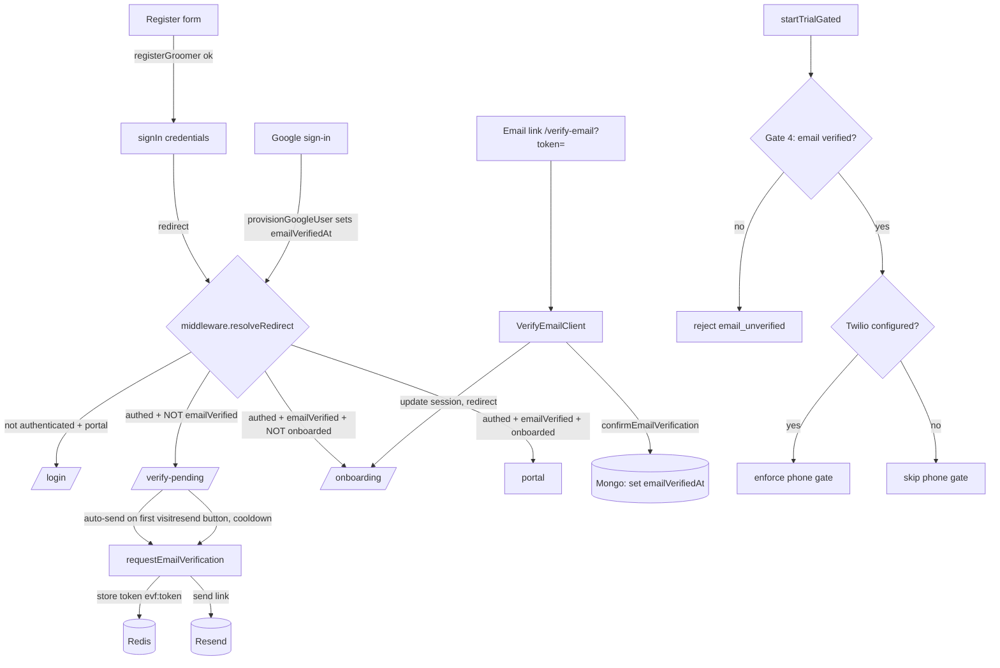

# Design Document

## Overview

This feature wires the already-shipped magic-link email verification flow
(`requestEmailVerification` / `confirmEmailVerification`, the `/verify-email`
page, and `User.emailVerifiedAt`) into the signup and route-protection path so
that email verification becomes the account-activation gate.

The change is deliberately small and reuses existing infrastructure (Resend,
Upstash Redis, NextAuth JWT, Mongoose). It touches four seams:

1. **Session claim** — add an `emailVerified` boolean to the NextAuth JWT and
   `Session`, stamped by the existing `jwt` callback on the same refresh path
   that already keeps `onboardingComplete` current. This lets the Edge
   middleware gate routes with zero per-request DB calls, exactly like the
   existing `onboardingComplete` / `access` claims.
2. **Access gate** — extend `resolveRedirect` in `src/middleware.ts` with one
   new rule, inserted *after* authentication and *before* the onboarding rule:
   an authenticated-but-unverified user is routed to a new
   `/verify-pending` screen. The billing-lockout rule continues to run last and
   is unchanged.
3. **Verification-pending screen** — a new standalone route `/verify-pending`
   that auto-sends a verification link on first visit, shows the user's email,
   and offers a Redis-backed rate-limited resend.
4. **Trial pipeline** — Gate 4 (email) is kept as a hard requirement; Gate 5
   (phone) becomes conditional on `isTwilioVerifyConfigured()` so the launch
   environment (Twilio unconfigured) does not hard-block trials.

Google OAuth users are stamped email-verified at provision time, and existing
active users are grandfathered by a one-time backfill script so the deploy
never locks anyone out.

### Key design decisions (resolved, not open questions)

| Decision | Choice | Rationale |
|---|---|---|
| Gate mechanism | **JWT claim** (`token.emailVerified`), not a per-request DB check | Mirrors the existing `onboardingComplete` / `access` claim pattern; the Edge middleware stays DB-free. |
| Claim freshness | Refresh in the `jwt` callback whenever `emailVerified !== true` (same shape as the onboarding refresh) | Once verified, the flag stops being re-queried; while unverified it is re-read so verification flips the claim on the next token refresh. |
| Mid-session recognition | `/verify-email` client calls `update()` (next-auth/react) after success, then redirects to `/onboarding` | Forces a `trigger === 'update'` jwt refresh so the claim flips without a manual sign-out/in (R5.3, R5.4). |
| Pending screen route | New standalone `/verify-pending` (sibling of `/onboarding`, `/verify-email`) | Must not be a portal route (those require verified) nor an auth route (those bounce signed-in users). Standalone, like `/onboarding`. |
| First send trigger | The `/verify-pending` page **auto-sends on first visit** via a server action, guarded by a "sent" flag | Avoids the registration race where the session is not yet established; the resend button reuses the same action (R1.2, R10.4). |
| Resend rate limit | Redis `SET NX EX 60` on `evf:rl:{normalizedEmail}` checked before `requestEmailVerification` | Backed by Redis so the cooldown holds across Vercel's serverless runtime (R9.3, R10.1). |
| Grandfathering | One-time backfill script, no ongoing special-case code | A backfill keeps the middleware clean — no "treat as verified if isActive" branch to maintain (R8). |
| Google verified | Set `emailVerifiedAt` in `provisionGoogleUser` | Single provisioning seam already runs on every Google sign-in (R7). |

## Architecture



### Redirect precedence in `resolveRedirect` (updated)

The new email-verification rule slots in as rule 2.5, between the auth-route
rule and the onboarding rule. Order matters so the existing invariants hold:

1. Unauthenticated on a portal route → `/login`.
2. Authenticated on an auth route (`/login`, `/register`) → `/verify-pending`
   if unverified, else `/onboarding` if incomplete, else `/dashboard`.
3. **(NEW)** Authenticated + **not** `emailVerified` + not already on
   `/verify-pending` and not on `/verify-email` → `/verify-pending`.
4. Authenticated + `emailVerified` + incomplete onboarding + not on
   `/onboarding` → `/onboarding`.
5. Billing hard-lockout rule (unchanged, runs last).

The no-self-redirect invariant is preserved: the new rule never fires when the
request is already on `/verify-pending` or `/verify-email`.

## Components and Interfaces

### 1. Session / JWT type augmentation — `src/types/next-auth.d.ts`

Add `emailVerified` to both the `Session.user` and `JWT` interfaces:

```typescript
// in declare module 'next-auth' → Session.user
/** Whether the user's email is verified (JWT-stamped, no DB read in middleware). */
emailVerified: boolean;

// in declare module 'next-auth/jwt' → JWT
/** Mirror of User.emailVerifiedAt != null, stamped by the jwt callback. */
emailVerified?: boolean;
```

### 2. Auth callbacks — `src/lib/auth/config.ts`

**(a) Stamp `emailVerified` in the `jwt` callback.** Extend the existing
profile-refresh block. The refresh condition reuses the same shape as the
onboarding refresh so the flag is re-read while unverified and stops once
verified:

```typescript
const needsVerifyRefresh = !!user || trigger === 'update' || token.emailVerified !== true;
if (token.userId && needsVerifyRefresh) {
  try {
    await connectDB();
    const u = await User.findById(token.userId).select('emailVerifiedAt').lean<{ emailVerifiedAt?: Date | null } | null>();
    token.emailVerified = !!u?.emailVerifiedAt;
  } catch (error) {
    console.error('Email-verification-status refresh failed:', error);
    token.emailVerified = token.emailVerified ?? false; // never throw out of jwt
  }
}
```

Project it onto the session in the `session` callback:
`session.user.emailVerified = token.emailVerified ?? false;`

**(b) Stamp Google users verified in `provisionGoogleUser`.** When creating the
OAuth user, set `emailVerifiedAt: new Date()`. When linking/finding an existing
user whose `emailVerifiedAt` is null, set it:

```typescript
// on create:
user = await User.create({ /* ...existing... */, emailVerifiedAt: new Date() });
// on find/link, if null:
if (!user.emailVerifiedAt) { user.emailVerifiedAt = new Date(); await user.save(); }
```

### 3. Middleware — `src/middleware.ts`

Add route helpers and extend `resolveRedirect`:

```typescript
const VERIFY_PENDING_ROUTE = '/verify-pending';
const VERIFY_EMAIL_ROUTE = '/verify-email';

function isVerificationRoute(pathname: string): boolean {
  return pathname === VERIFY_PENDING_ROUTE || pathname.startsWith(`${VERIFY_PENDING_ROUTE}/`)
    || pathname === VERIFY_EMAIL_ROUTE || pathname.startsWith(`${VERIFY_EMAIL_ROUTE}/`);
}
```

`resolveRedirect` gains an `emailVerified: boolean | undefined` parameter.
The auth-route branch (rule 2) picks `/verify-pending` first when unverified.
A new rule 3 fires for any authenticated unverified request not already on a
verification route. The `withAuth` wrapper reads `token?.emailVerified` and
passes it in. `emailVerified` is treated as **true when undefined** on the
server side only for backward-compat with not-yet-stamped tokens is **not**
done here — instead undefined is treated as *false* (route to pending), which
is the safe default; the backfill + jwt refresh ensure real users get `true`
quickly. The matcher must include `/verify-pending` and `/verify-email` so the
middleware runs on them (to allow them through and to redirect away once
verified).

### 4. Verification-pending screen — new files

**`src/app/verify-pending/page.tsx`** (server component): resolves the session,
loads the user's email, renders `VerifyPendingClient` with the email. Public
shell like `/verify-email/page.tsx`; `dynamic = 'force-dynamic'`.

**`src/app/verify-pending/VerifyPendingClient.tsx`** (client component):

- On mount, auto-invokes a resend server action **once** (guarded by a ref/flag
  so React StrictMode's double-mount doesn't double-send).
- Renders the account email (R3.1).
- A resend button bound to the same action, disabled while in flight (R3.5) and
  during the cooldown window, showing remaining seconds (R3.4).
- State machine: `sending → sent (delivered) | sent-dev (delivered:false) | cooldown | error-recoverable`.
  Maps `requestEmailVerification` envelopes: `delivered:false` → "accepted but
  delivery unconfirmed" (R3.6); `reason: 'not_configured'` → recoverable retry
  (R3.7).

### 5. Resend-with-cooldown server action — `src/actions/verification.ts`

Add a thin wrapper that enforces the Redis-backed cooldown, then delegates:

```typescript
export type ResendCooldownResult =
  | { ok: true; delivered: boolean; message: string }
  | { ok: false; reason: 'cooldown'; retryAfterSec: number; message: string }
  | { ok: false; reason: VerificationFailureReason; message: string };

export async function resendEmailVerification(): Promise<ResendCooldownResult> {
  // 1. require session (not_signed_in)
  // 2. load user email → normalizeEmail
  // 3. SET NX EX 60 on keys.emailVerifyResend(normalizedEmail)
  //    - if not acquired, read TTL and return { ok:false, reason:'cooldown', retryAfterSec }
  // 4. delegate to requestEmailVerification(); map its envelope through.
}
```

Add the Redis key + TTL:

```typescript
// src/lib/redis.ts keys:
emailVerifyResend: (normalizedEmail: string) => `evf:rl:${normalizedEmail}`,
// TTL:
EMAIL_VERIFY_RESEND: 60, // evf:rl:{email}  EX 60 (resend cooldown)
```

The cooldown is keyed on the **normalized** email (R9.5) and backed by Redis so
it holds across serverless invocations (R9.3, R10.1).

### 6. Register form — `src/app/(auth)/register/RegisterForm.tsx`

After a successful credentials `signIn`, the user is unverified, so the
destination should let the middleware route them. Change the post-signIn
`router.push(onboardingUrl)` to `router.push('/verify-pending')` (or push
`/onboarding` and rely on the middleware to bounce to `/verify-pending`). The
chosen approach is an explicit `router.push('/verify-pending')` for clarity;
the claim slug is still carried for Google via `callbackUrl` unchanged (R1.1,
R1.2, R10.4).

### 7. Verify-email client — `src/app/verify-email/VerifyEmailClient.tsx`

On success, call `update()` from `next-auth/react` (forces a jwt refresh with
`trigger === 'update'`, re-reading `emailVerifiedAt`) and then
`router.push('/onboarding')`. The middleware will route onward correctly once
the claim flips (R4.3, R5.3, R5.4). Keep the existing invalid/expired state,
pointing its recovery link at `/verify-pending` (which offers resend) instead
of `/start-trial` (R4.4, R3.x).

### 8. Trial pipeline — `src/actions/trial.ts`

Make Gate 5 conditional:

```typescript
// --- Gate 5: Phone verified (R6, conditional on Twilio) ---
let phoneHash: string | null = null;
if (isTwilioVerifyConfigured()) {
  const phoneE164 = normalizePhoneE164(input?.phoneE164 ?? '', getDefaultPhoneRegion());
  if (!phoneE164) {
    return { ok: false, reason: 'phone_unverified', message: 'Please verify your phone number first.' };
  }
  phoneHash = computePhoneHash(phoneE164);
}
```

When Twilio is unconfigured, the phone gate is skipped and `phoneHash` is null.
Gates 6–8 (velocity, identity-binding, provisioning) continue to run. The
identity-binding gate (Gate 7) currently keys on `phoneHash`; when the phone is
skipped, bind on the normalized email instead so the one-trial-per-identity
guarantee is preserved without a phone (R6.4, R6.5). Add `isTwilioVerifyConfigured`
to the imports from `@/lib/identity/config`.

### 9. Grandfathering backfill — new file `scripts/backfill-email-verified.ts`

A one-time Node/ts script (mirroring `scripts/backfill-trial-deadline.ts`) that
connects to Mongo and runs:

```typescript
await User.updateMany(
  { isActive: true, $or: [{ emailVerifiedAt: null }, { emailVerifiedAt: { $exists: false } }] },
  [{ $set: { emailVerifiedAt: '$createdAt' } }] // or new Date() if createdAt absent
);
```

Users with a non-null `emailVerifiedAt` are left unchanged (R8.4). Users created
after deploy are not matched by any ongoing code path, so they must verify
(R8.5). The script logs the modified count and exits.

## Data Models

No schema changes. The feature reuses the existing fields:

- **`User.emailVerifiedAt: Date | null`** — the single source of truth for
  verification. Already present and already set by `confirmEmailVerification`.
- **`User.isActive: boolean`** — used only by the backfill to select
  grandfathered users.
- **Redis `evf:{token}` → `EmailVerifyRecord { normalizedEmail }`** — the
  existing one-time token (unchanged).
- **Redis `evf:rl:{normalizedEmail}` → `'1'` (EX 60)** — new resend-cooldown
  marker.
- **JWT `emailVerified?: boolean`** — new claim, mirrors `emailVerifiedAt != null`.

## Correctness Properties

This feature applies property-based testing to a focused subset: the pure
redirect-resolution logic in `resolveRedirect` and the conditional gate logic.
The rest of the feature is wiring to external services (Resend, Redis, NextAuth
session, React UI) and is better covered by example-based and integration
tests (see Testing Strategy). The redirect function is already a pure,
unit-testable function in the codebase, which makes it a strong PBT target.

*A property is a characteristic or behavior that should hold true across all valid executions of a system — a formal statement about what the system should do, bridging human-readable specifications and machine-verifiable correctness guarantees.*

### Property 1: Unverified authenticated users are always routed to the pending screen

*For all* authenticated users whose `emailVerified` is false and any requested
`pathname` that is a Portal_Route or the Onboarding_Flow (and is not itself a
verification route), `resolveRedirect` SHALL return `/verify-pending`.

**Validates: Requirements 2.1, 2.2, 5.1**

### Property 2: Verification routes are always allowed through for unverified users

*For all* authenticated unverified users requesting `/verify-pending` or
`/verify-email` (with any query string), `resolveRedirect` SHALL return `null`
(request allowed, no redirect to itself).

**Validates: Requirements 2.5, 2.6**

### Property 3: Verified routing is never weakened

*For all* authenticated users whose `emailVerified` is true, `resolveRedirect`
SHALL produce exactly the destination it produced before this feature existed
for the same `(pathname, onboardingComplete, access)` inputs — i.e. onboarding
when incomplete, the billing lockout when access denies, otherwise through.

**Validates: Requirements 2.4, 5.2, 5.5**

### Property 4: The redirect function never redirects a path to itself

*For all* input combinations of `(pathname, isAuthenticated, emailVerified,
onboardingComplete, access)`, the value returned by `resolveRedirect` is never
equal to the input `pathname`.

**Validates: Requirements 2.1, 2.2, 5.5**

### Property 5: Phone gate enforcement tracks Twilio configuration

*For all* trial requests reaching Gate 5, when Twilio is configured the gate
rejects iff no valid canonical phone is present, and when Twilio is unconfigured
the gate is skipped regardless of the phone input, while the email gate (Gate 4)
rejects for all unverified users independent of Twilio state.

**Validates: Requirements 6.1, 6.2, 6.3**

### Property 6: Resend cooldown is idempotent within the window

*For all* sequences of resend requests for the same normalized email issued
within the cooldown window, exactly the first acquires the Redis marker and
proceeds; every subsequent request within the window is rejected with a
`cooldown` reason and a non-negative `retryAfterSec`, and no additional link is
sent.

**Validates: Requirements 3.4, 10.1, 9.3**

## Error Handling

- **Resend provider unconfigured/unavailable** — `requestEmailVerification`
  already returns `ok:true, delivered:false`; the pending screen renders the
  "accepted but delivery unconfirmed" state (R1.3, R3.6, R9.2). Registration
  still completes and routes to `/verify-pending` (R1.3).
- **Redis unavailable at send** — `requestEmailVerification` returns
  `reason:'not_configured'`; the pending screen shows a recoverable retry state
  (R1.5, R3.7). Registration is not discarded.
- **Redis unavailable at cooldown check** — the cooldown wrapper fails *open*
  (skips the cooldown and delegates) so a Redis outage never traps the user with
  no path forward (R9.2); the underlying send still enforces its own
  `not_configured` behavior.
- **jwt callback DB error** — the stamp block catches and leaves
  `token.emailVerified` at its prior value (never throws out of the callback),
  consistent with the existing onboarding/access refresh handling.
- **Expired/invalid/burned token** — `confirmEmailVerification` already returns
  the same `expired`/`invalid_code` envelope with no account change; the
  verify-email client shows a recoverable state whose link points at
  `/verify-pending` (R4.4, R4.5, R10.5).
- **Google provisioning DB error** — `provisionGoogleUser` is best-effort and
  returns `null` on error without throwing; the `emailVerifiedAt` stamp is part
  of the same best-effort path (R7.2).

## Testing Strategy

### Property-based tests (pure logic only)

Use the project's existing test runner with a property library for the target
language (e.g. `fast-check` for TypeScript — do not hand-roll generators). Each
property test runs **minimum 100 iterations** and is tagged
`Feature: email-verification-signup, Property N: {property text}`.

- `resolveRedirect` → Properties 1–4 (generate `pathname` from the known route
  sets, booleans for auth/verified/onboarded, and `access` decisions).
- Gate-5 conditional logic → Property 5 (extract the gate decision into a pure
  helper so it can be tested without the full pipeline I/O).
- Resend cooldown → Property 6 (against a mocked/in-memory Redis so iterations
  stay cheap).

### Example-based unit tests

- `VerifyPendingClient` state machine: auto-send-once (StrictMode double mount
  sends once), resend disabled while in flight, cooldown countdown, each
  envelope → state mapping (R3.3–R3.7).
- `provisionGoogleUser` sets `emailVerifiedAt` on create and on link-when-null,
  leaves a non-null value unchanged (R7.2).
- jwt-callback stamp: unverified→verified flip on `trigger === 'update'` (R5.4).

### Integration / behavioral tests

- Backfill script: against a test DB, verifies only `isActive && null` users are
  updated and non-null values are preserved (R8.3, R8.4).
- Registration → `/verify-pending` redirect path (R1.1, R1.2).
- `/verify-email` success → `update()` → middleware allows onboarding without
  re-login (R5.3) — exercised as a route/integration test, 1–2 examples.

### Why PBT is scoped narrowly

The UI rendering, NextAuth session plumbing, Resend/Redis I/O, and the backfill
are side-effect or external-service bound; per the PBT guidance these use
example-based and integration tests with 1–3 representative cases rather than
100-iteration property tests. Only the pure decision functions
(`resolveRedirect`, the gate predicate, the cooldown predicate) carry
properties.
