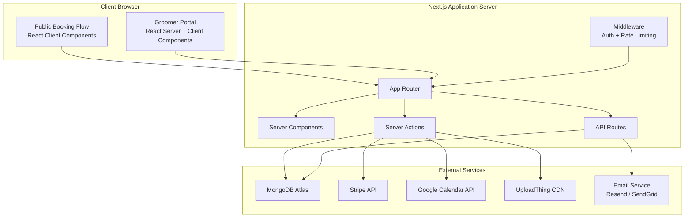
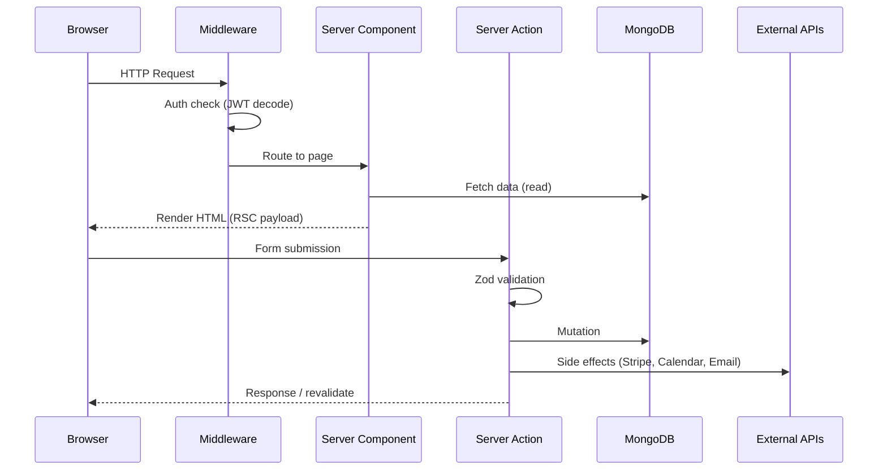
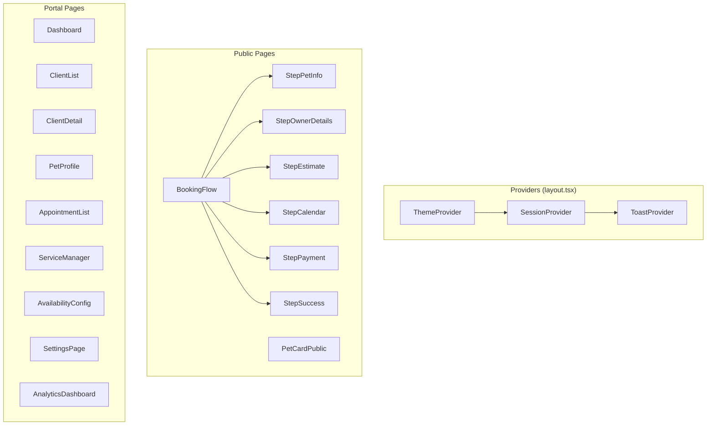
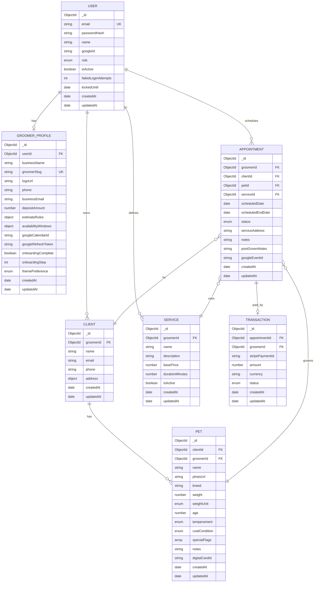
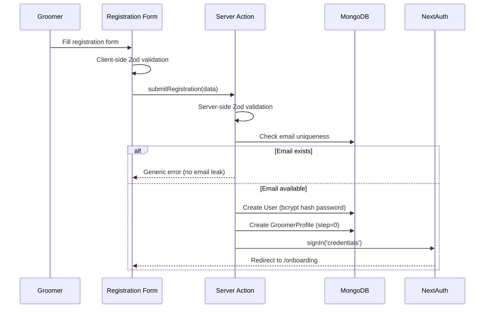
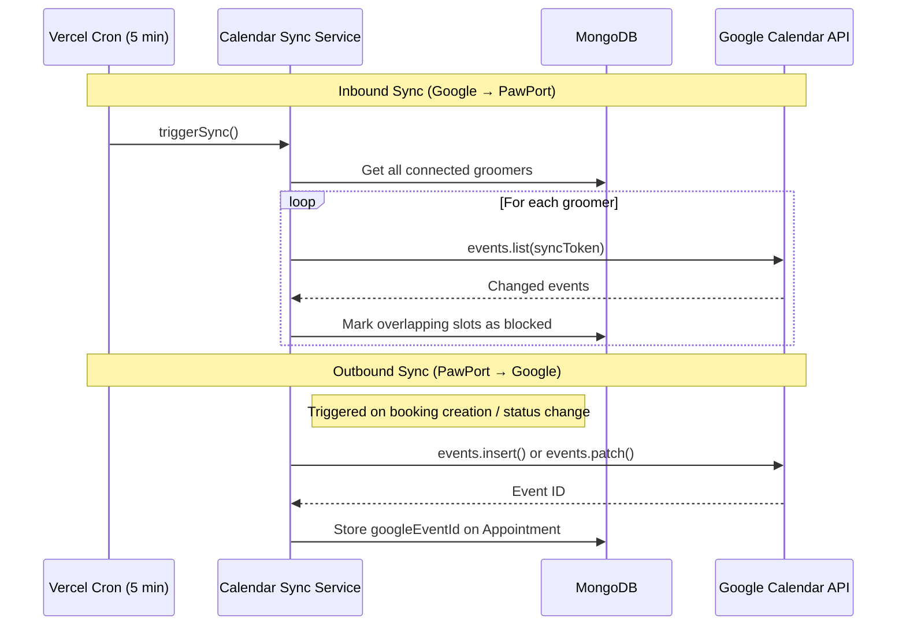

# Design Document — PawPort

## Overview

PawPort is a mobile-first SaaS platform for solo mobile pet groomers. It enables groomers to accept online bookings with Stripe deposits, manage clients/pets with full service history, generate branded Digital Pet Cards, and reduce no-shows through automated workflows.

The system is built as a monolithic Next.js 14+ application using the App Router pattern. It separates concerns into a public-facing booking experience (unauthenticated) and a private Groomer Portal (authenticated). The architecture leverages server components for SEO-critical pages, server actions for mutations, and client components for interactive forms and real-time UI.

### Key Design Decisions

| Decision | Rationale |
|----------|-----------|
| Next.js App Router (monolith) | Single deployment, shared types, simplified DevOps for solo-groomer scale |
| MongoDB + Mongoose | Flexible schema for pet/service data that varies per groomer; embedded documents for performance |
| NextAuth.js | Battle-tested auth with built-in session management, JWT strategy for stateless sessions |
| Server Actions for mutations | Collocated validation, reduced API surface, progressive enhancement |
| React Hook Form + Zod | Type-safe validation shared between client and server |
| DaisyUI custom theme | Rapid theming with semantic color tokens; light/dark mode via CSS variables |
| UploadThing for file uploads | Purpose-built for Next.js, handles presigned URLs and progress natively |

---

## Architecture

### High-Level System Diagram



### Request Flow Architecture



### Deployment Architecture

- **Hosting**: Vercel (optimized for Next.js)
- **Database**: MongoDB Atlas (M10+ for production)
- **CDN**: Vercel Edge Network for static assets; UploadThing CDN for uploaded images
- **Cron Jobs**: Vercel Cron for calendar sync polling (every 5 minutes)
- **Environment**: Node.js 18+ runtime

---

## Components and Interfaces

### Project Folder Structure

```
src/
├── app/
│   ├── (auth)/
│   │   ├── login/page.tsx
│   │   ├── register/page.tsx
│   │   └── layout.tsx
│   ├── (portal)/
│   │   ├── dashboard/page.tsx
│   │   ├── clients/
│   │   │   ├── page.tsx
│   │   │   └── [clientId]/page.tsx
│   │   ├── pets/[petId]/page.tsx
│   │   ├── appointments/
│   │   │   ├── page.tsx
│   │   │   └── [appointmentId]/page.tsx
│   │   ├── services/page.tsx
│   │   ├── availability/page.tsx
│   │   ├── settings/page.tsx
│   │   ├── analytics/page.tsx
│   │   └── layout.tsx
│   ├── (public)/
│   │   ├── book/[groomerSlug]/page.tsx
│   │   └── pet-card/[cardId]/page.tsx
│   ├── onboarding/
│   │   └── page.tsx
│   ├── api/
│   │   ├── auth/[...nextauth]/route.ts
│   │   ├── webhooks/stripe/route.ts
│   │   ├── cron/calendar-sync/route.ts
│   │   └── uploadthing/route.ts
│   ├── layout.tsx
│   └── globals.css
├── components/
│   ├── ui/                    # Shared UI primitives (buttons, inputs, cards)
│   ├── booking/               # Booking flow step components
│   ├── portal/                # Portal-specific components
│   ├── pet-card/              # Digital Pet Card renderer
│   └── providers/             # Context providers (theme, toast, session)
├── lib/
│   ├── db/
│   │   ├── connect.ts         # MongoDB connection singleton
│   │   └── models/            # Mongoose model definitions
│   ├── auth/
│   │   ├── config.ts          # NextAuth configuration
│   │   ├── middleware.ts      # Auth middleware helpers
│   │   └── session.ts         # Session utilities
│   ├── stripe/
│   │   ├── client.ts          # Stripe SDK initialization
│   │   └── helpers.ts         # Payment intent helpers
│   ├── calendar/
│   │   ├── client.ts          # Google Calendar API client
│   │   ├── sync.ts            # Bidirectional sync logic
│   │   └── availability.ts    # Available slot computation
│   ├── estimate/
│   │   └── engine.ts          # Price estimate calculation
│   ├── email/
│   │   └── send.ts            # Email sending with templates
│   ├── upload/
│   │   └── config.ts          # UploadThing configuration
│   └── validators/
│       ├── auth.ts            # Auth-related Zod schemas
│       ├── booking.ts         # Booking flow Zod schemas
│       ├── pet.ts             # Pet-related Zod schemas
│       ├── service.ts         # Service-related Zod schemas
│       └── settings.ts        # Settings Zod schemas
├── actions/
│   ├── auth.ts                # Registration, login actions
│   ├── booking.ts             # Booking flow mutations
│   ├── appointments.ts        # Appointment status changes
│   ├── clients.ts             # Client CRUD
│   ├── pets.ts                # Pet CRUD + card generation
│   ├── services.ts            # Service CRUD
│   ├── availability.ts        # Availability configuration
│   └── settings.ts            # Business settings mutations
├── hooks/
│   ├── useBookingFlow.ts      # Multi-step booking state machine
│   ├── useDebounce.ts         # Debounced search
│   └── useMediaQuery.ts       # Responsive breakpoint hooks
├── types/
│   └── index.ts               # Shared TypeScript interfaces
└── config/
    ├── breeds.ts              # Predefined breed lists
    ├── temperaments.ts        # Predefined temperament options
    └── constants.ts           # App-wide constants
```

### Component Architecture



### Key Interfaces

```typescript
// lib/estimate/engine.ts
interface EstimateInput {
  petWeight: number;
  coatCondition: CoatCondition;
  serviceBasePrice: number;
  estimateRules: EstimateRule[];
}

interface EstimateResult {
  minPrice: number;
  maxPrice: number;
  currency: string;
}

function calculateEstimate(input: EstimateInput): EstimateResult;

// lib/calendar/availability.ts
interface AvailabilityQuery {
  groomerId: string;
  startDate: Date;
  endDate: Date;
  serviceDurationMinutes: number;
}

interface TimeSlot {
  start: Date;
  end: Date;
  available: boolean;
}

function getAvailableSlots(query: AvailabilityQuery): Promise<TimeSlot[]>;

// lib/calendar/sync.ts
interface SyncResult {
  eventsCreated: number;
  eventsUpdated: number;
  slotsBlocked: number;
  errors: SyncError[];
}

function syncGroomerCalendar(groomerId: string): Promise<SyncResult>;

// actions/booking.ts
interface BookingPayload {
  groomerSlug: string;
  pet: PetInfoInput;
  owner: OwnerDetailsInput;
  selectedSlot: TimeSlot;
  stripePaymentIntentId: string;
}

function createBooking(payload: BookingPayload): Promise<BookingResult>;
```

---

## Data Models

### Entity Relationship Diagram



### Mongoose Schema Definitions

```typescript
// lib/db/models/user.ts
import { Schema, model, models } from 'mongoose';

const userSchema = new Schema({
  email: {
    type: String,
    required: true,
    unique: true,
    lowercase: true,
    trim: true,
    maxlength: 254,
  },
  passwordHash: { type: String }, // null for OAuth users
  name: { type: String, required: true, maxlength: 100 },
  googleId: { type: String, sparse: true, unique: true },
  role: { type: String, enum: ['groomer'], default: 'groomer' },
  isActive: { type: Boolean, default: false },
  failedLoginAttempts: { type: Number, default: 0 },
  lockedUntil: { type: Date, default: null },
}, { timestamps: true });

userSchema.index({ email: 1 });

export const User = models.User || model('User', userSchema);
```

```typescript
// lib/db/models/groomer-profile.ts
const estimateRuleSchema = new Schema({
  coatCondition: { type: String, enum: ['smooth', 'double', 'wire', 'curly', 'long', 'matted'] },
  weightRange: { min: Number, max: Number },
  priceAdjustmentPercent: { type: Number, min: -50, max: 50 },
  note: { type: String, maxlength: 500 },
}, { _id: false });

const availabilityWindowSchema = new Schema({
  dayOfWeek: { type: Number, min: 0, max: 6 }, // 0 = Monday
  startTime: { type: String }, // "09:00" (15-min increments)
  endTime: { type: String },   // "17:00"
}, { _id: false });

const blockedDateSchema = new Schema({
  startDateTime: { type: Date, required: true },
  endDateTime: { type: Date, required: true },
}, { _id: false });

const groomerProfileSchema = new Schema({
  userId: { type: Schema.Types.ObjectId, ref: 'User', required: true, unique: true },
  businessName: { type: String, maxlength: 100 },
  groomerSlug: { type: String, unique: true, lowercase: true, match: /^[a-z0-9-]{3,40}$/ },
  logoUrl: { type: String },
  phone: { type: String, maxlength: 15 },
  businessEmail: { type: String, maxlength: 254 },
  depositAmount: { type: Number, min: 0, max: 500, default: 25 },
  estimateRules: [estimateRuleSchema],
  availabilityWindows: [availabilityWindowSchema],
  blockedDates: [blockedDateSchema],
  googleCalendarId: { type: String },
  googleRefreshToken: { type: String },
  googleCalendarConnected: { type: Boolean, default: false },
  onboardingComplete: { type: Boolean, default: false },
  onboardingStep: { type: Number, default: 0 },
  themePreference: { type: String, enum: ['light', 'dark'], default: 'light' },
  serviceIntervalDays: { type: Number, default: 42 }, // 6 weeks
}, { timestamps: true });

groomerProfileSchema.index({ groomerSlug: 1 });
groomerProfileSchema.index({ userId: 1 });

export const GroomerProfile = models.GroomerProfile || model('GroomerProfile', groomerProfileSchema);
```

```typescript
// lib/db/models/client.ts
const addressSchema = new Schema({
  street: { type: String, required: true, maxlength: 200 },
  city: { type: String, required: true, maxlength: 100 },
  state: { type: String, required: true, maxlength: 100 },
  postalCode: { type: String, required: true, maxlength: 20 },
}, { _id: false });

const clientSchema = new Schema({
  groomerId: { type: Schema.Types.ObjectId, ref: 'User', required: true },
  name: { type: String, required: true, maxlength: 100 },
  email: { type: String, required: true, lowercase: true, maxlength: 254 },
  phone: { type: String, required: true, maxlength: 15 },
  address: { type: addressSchema, required: true },
}, { timestamps: true });

clientSchema.index({ groomerId: 1, email: 1 }, { unique: true });
clientSchema.index({ groomerId: 1, name: 'text', email: 'text', phone: 'text' });

export const Client = models.Client || model('Client', clientSchema);
```

```typescript
// lib/db/models/pet.ts
const petSchema = new Schema({
  clientId: { type: Schema.Types.ObjectId, ref: 'Client', required: true },
  groomerId: { type: Schema.Types.ObjectId, ref: 'User', required: true },
  name: { type: String, required: true, maxlength: 50 },
  photoUrl: { type: String },
  breed: { type: String, required: true },
  weight: { type: Number, required: true, min: 1, max: 200 },
  weightUnit: { type: String, enum: ['lbs', 'kg'], default: 'lbs' },
  age: { type: Number, required: true, min: 0, max: 30 },
  temperament: { type: String, required: true, enum: ['calm', 'nervous', 'aggressive', 'friendly'] },
  coatCondition: { type: String, required: true, enum: ['smooth', 'double', 'wire', 'curly', 'long', 'matted'] },
  specialFlags: [{ type: String }],
  notes: { type: String, maxlength: 500 },
  digitalCardId: { type: String, unique: true, sparse: true },
}, { timestamps: true });

petSchema.index({ clientId: 1 });
petSchema.index({ groomerId: 1 });
petSchema.index({ digitalCardId: 1 });

export const Pet = models.Pet || model('Pet', petSchema);
```

```typescript
// lib/db/models/service.ts
const serviceSchema = new Schema({
  groomerId: { type: Schema.Types.ObjectId, ref: 'User', required: true },
  name: { type: String, required: true, maxlength: 100 },
  description: { type: String, maxlength: 500 },
  basePrice: { type: Number, required: true, min: 0.01, max: 9999.99 },
  durationMinutes: { type: Number, required: true, min: 15, max: 480 },
  isActive: { type: Boolean, default: true },
}, { timestamps: true });

serviceSchema.index({ groomerId: 1, isActive: 1 });

export const Service = models.Service || model('Service', serviceSchema);
```

```typescript
// lib/db/models/appointment.ts
const appointmentSchema = new Schema({
  groomerId: { type: Schema.Types.ObjectId, ref: 'User', required: true },
  clientId: { type: Schema.Types.ObjectId, ref: 'Client', required: true },
  petId: { type: Schema.Types.ObjectId, ref: 'Pet', required: true },
  serviceId: { type: Schema.Types.ObjectId, ref: 'Service', required: true },
  scheduledDate: { type: Date, required: true },
  scheduledEndDate: { type: Date, required: true },
  status: {
    type: String,
    enum: ['upcoming', 'in-progress', 'completed', 'cancelled'],
    default: 'upcoming',
  },
  serviceAddress: { type: String, maxlength: 500 },
  notes: { type: String, maxlength: 500 },
  postGroomNotes: { type: String, maxlength: 2000 },
  googleEventId: { type: String },
}, { timestamps: true });

appointmentSchema.index({ groomerId: 1, scheduledDate: 1 });
appointmentSchema.index({ groomerId: 1, status: 1 });
appointmentSchema.index({ clientId: 1 });
appointmentSchema.index({ petId: 1 });

export const Appointment = models.Appointment || model('Appointment', appointmentSchema);
```

```typescript
// lib/db/models/transaction.ts
const transactionSchema = new Schema({
  appointmentId: { type: Schema.Types.ObjectId, ref: 'Appointment', required: true },
  groomerId: { type: Schema.Types.ObjectId, ref: 'User', required: true },
  stripePaymentId: { type: String, required: true, unique: true },
  amount: { type: Number, required: true, min: 0 },
  currency: { type: String, default: 'usd', maxlength: 3 },
  status: {
    type: String,
    enum: ['pending', 'succeeded', 'failed', 'refunded'],
    default: 'pending',
  },
}, { timestamps: true });

transactionSchema.index({ appointmentId: 1 });
transactionSchema.index({ groomerId: 1, createdAt: -1 });
transactionSchema.index({ stripePaymentId: 1 });

export const Transaction = models.Transaction || model('Transaction', transactionSchema);
```

### MongoDB Connection Singleton

```typescript
// lib/db/connect.ts
import mongoose from 'mongoose';

const MONGODB_URI = process.env.MONGODB_URI!;

let cached = (global as any).mongoose;
if (!cached) {
  cached = (global as any).mongoose = { conn: null, promise: null };
}

export async function connectDB(): Promise<typeof mongoose> {
  if (cached.conn) return cached.conn;

  if (!cached.promise) {
    cached.promise = mongoose.connect(MONGODB_URI, {
      bufferCommands: false,
      maxPoolSize: 10,
    });
  }
  cached.conn = await cached.promise;
  return cached.conn;
}
```

---

## Authentication Flow

### NextAuth.js Configuration

```typescript
// lib/auth/config.ts
import { NextAuthOptions } from 'next-auth';
import CredentialsProvider from 'next-auth/providers/credentials';
import GoogleProvider from 'next-auth/providers/google';
import bcrypt from 'bcryptjs';
import { connectDB } from '@/lib/db/connect';
import { User } from '@/lib/db/models/user';
import { GroomerProfile } from '@/lib/db/models/groomer-profile';

export const authOptions: NextAuthOptions = {
  providers: [
    CredentialsProvider({
      name: 'credentials',
      credentials: {
        email: { label: 'Email', type: 'email' },
        password: { label: 'Password', type: 'password' },
      },
      async authorize(credentials) {
        await connectDB();
        const user = await User.findOne({ email: credentials?.email?.toLowerCase() });

        if (!user) return null;

        // Check account lock
        if (user.lockedUntil && user.lockedUntil > new Date()) return null;

        const isValid = await bcrypt.compare(credentials!.password, user.passwordHash);

        if (!isValid) {
          // Increment failed attempts
          user.failedLoginAttempts += 1;
          if (user.failedLoginAttempts >= 5) {
            user.lockedUntil = new Date(Date.now() + 30 * 60 * 1000); // 30 min
          }
          await user.save();
          return null;
        }

        // Reset on success
        user.failedLoginAttempts = 0;
        user.lockedUntil = null;
        await user.save();

        return { id: user._id.toString(), email: user.email, name: user.name };
      },
    }),
    GoogleProvider({
      clientId: process.env.GOOGLE_CLIENT_ID!,
      clientSecret: process.env.GOOGLE_CLIENT_SECRET!,
    }),
  ],
  session: {
    strategy: 'jwt',
    maxAge: 7 * 24 * 60 * 60, // 7 days
  },
  callbacks: {
    async jwt({ token, user }) {
      if (user) {
        token.userId = user.id;
      }
      return token;
    },
    async session({ session, token }) {
      if (token.userId) {
        session.user.id = token.userId as string;
        const profile = await GroomerProfile.findOne({ userId: token.userId }).lean();
        session.user.onboardingComplete = profile?.onboardingComplete ?? false;
        session.user.groomerSlug = profile?.groomerSlug ?? null;
      }
      return session;
    },
  },
  pages: {
    signIn: '/login',
    error: '/login',
  },
};
```

### Middleware (Route Protection)

```typescript
// middleware.ts
import { withAuth } from 'next-auth/middleware';
import { NextResponse } from 'next/server';

export default withAuth(
  function middleware(req) {
    const { pathname } = req.nextUrl;
    const token = req.nextauth.token;

    // Redirect unauthenticated users from portal routes
    if (!token && pathname.startsWith('/dashboard')) {
      return NextResponse.redirect(new URL('/login', req.url));
    }

    // Redirect to onboarding if not complete
    if (token && !token.onboardingComplete && !pathname.startsWith('/onboarding')) {
      return NextResponse.redirect(new URL('/onboarding', req.url));
    }

    return NextResponse.next();
  },
  {
    callbacks: {
      authorized: ({ token, req }) => {
        const { pathname } = req.nextUrl;
        // Public routes don't need auth
        if (pathname.startsWith('/book/') || pathname.startsWith('/pet-card/')) return true;
        if (pathname.startsWith('/login') || pathname.startsWith('/register')) return true;
        // Portal routes require auth
        return !!token;
      },
    },
  }
);

export const config = {
  matcher: ['/((?!api|_next/static|_next/image|favicon.ico).*)'],
};
```

### Registration Flow



---

## Public Booking Flow

### Multi-Step State Machine

```typescript
// hooks/useBookingFlow.ts
import { useReducer } from 'react';

type BookingStep = 'pet-info' | 'owner-details' | 'estimate' | 'calendar' | 'payment' | 'success';

interface BookingState {
  currentStep: BookingStep;
  stepIndex: number;
  petInfo: PetInfoInput | null;
  ownerDetails: OwnerDetailsInput | null;
  estimate: EstimateResult | null;
  selectedSlot: TimeSlot | null;
  paymentResult: PaymentResult | null;
}

type BookingAction =
  | { type: 'SUBMIT_PET_INFO'; payload: PetInfoInput }
  | { type: 'SUBMIT_OWNER_DETAILS'; payload: OwnerDetailsInput }
  | { type: 'CONFIRM_ESTIMATE'; payload: EstimateResult }
  | { type: 'SELECT_SLOT'; payload: TimeSlot }
  | { type: 'PAYMENT_SUCCESS'; payload: PaymentResult }
  | { type: 'GO_BACK' };

const STEPS: BookingStep[] = ['pet-info', 'owner-details', 'estimate', 'calendar', 'payment', 'success'];

function bookingReducer(state: BookingState, action: BookingAction): BookingState {
  switch (action.type) {
    case 'SUBMIT_PET_INFO':
      return { ...state, petInfo: action.payload, currentStep: 'owner-details', stepIndex: 1 };
    case 'SUBMIT_OWNER_DETAILS':
      return { ...state, ownerDetails: action.payload, currentStep: 'estimate', stepIndex: 2 };
    case 'CONFIRM_ESTIMATE':
      return { ...state, estimate: action.payload, currentStep: 'calendar', stepIndex: 3 };
    case 'SELECT_SLOT':
      return { ...state, selectedSlot: action.payload, currentStep: 'payment', stepIndex: 4 };
    case 'PAYMENT_SUCCESS':
      return { ...state, paymentResult: action.payload, currentStep: 'success', stepIndex: 5 };
    case 'GO_BACK':
      const prevIndex = Math.max(0, state.stepIndex - 1);
      return { ...state, currentStep: STEPS[prevIndex], stepIndex: prevIndex };
    default:
      return state;
  }
}

export function useBookingFlow() {
  const [state, dispatch] = useReducer(bookingReducer, {
    currentStep: 'pet-info',
    stepIndex: 0,
    petInfo: null,
    ownerDetails: null,
    estimate: null,
    selectedSlot: null,
    paymentResult: null,
  });

  return { state, dispatch, totalSteps: STEPS.length };
}
```

### Estimate Engine

```typescript
// lib/estimate/engine.ts
import { EstimateInput, EstimateResult, EstimateRule } from '@/types';

const BASE_COAT_MULTIPLIERS: Record<string, number> = {
  smooth: 1.0,
  double: 1.2,
  wire: 1.15,
  curly: 1.25,
  long: 1.3,
  matted: 1.5,
};

const WEIGHT_TIERS = [
  { max: 15, multiplier: 0.8 },   // Small
  { max: 40, multiplier: 1.0 },   // Medium
  { max: 80, multiplier: 1.3 },   // Large
  { max: 200, multiplier: 1.6 },  // Extra Large
];

export function calculateEstimate(input: EstimateInput): EstimateResult {
  const { petWeight, coatCondition, serviceBasePrice, estimateRules } = input;

  // Base calculation
  const coatMultiplier = BASE_COAT_MULTIPLIERS[coatCondition] ?? 1.0;
  const weightTier = WEIGHT_TIERS.find(t => petWeight <= t.max) ?? WEIGHT_TIERS[WEIGHT_TIERS.length - 1];
  const weightMultiplier = weightTier.multiplier;

  let baseEstimate = serviceBasePrice * coatMultiplier * weightMultiplier;

  // Apply groomer's custom rules
  let totalAdjustment = 0;
  for (const rule of estimateRules) {
    if (ruleApplies(rule, petWeight, coatCondition)) {
      totalAdjustment += rule.priceAdjustmentPercent;
    }
  }

  // Clamp adjustment to -50% to +50%
  totalAdjustment = Math.max(-50, Math.min(50, totalAdjustment));
  baseEstimate *= (1 + totalAdjustment / 100);

  // Return range (min = 90% of estimate, max = 110%)
  const minPrice = Math.max(0.01, roundToTwoDecimals(baseEstimate * 0.9));
  const maxPrice = roundToTwoDecimals(baseEstimate * 1.1);

  return { minPrice, maxPrice, currency: 'USD' };
}

function ruleApplies(rule: EstimateRule, weight: number, coat: string): boolean {
  const coatMatch = !rule.coatCondition || rule.coatCondition === coat;
  const weightMatch = !rule.weightRange ||
    (weight >= rule.weightRange.min && weight <= rule.weightRange.max);
  return coatMatch && weightMatch;
}

function roundToTwoDecimals(value: number): number {
  return Math.round(value * 100) / 100;
}
```

### Stripe Payment Integration

```typescript
// lib/stripe/client.ts
import Stripe from 'stripe';

export const stripe = new Stripe(process.env.STRIPE_SECRET_KEY!, {
  apiVersion: '2024-04-10',
});

// actions/booking.ts — createPaymentIntent
export async function createDepositPaymentIntent(
  groomerId: string,
  amount: number,
  metadata: Record<string, string>
): Promise<{ clientSecret: string }> {
  const profile = await GroomerProfile.findOne({ userId: groomerId }).lean();
  if (!profile) throw new Error('Groomer not found');

  const paymentIntent = await stripe.paymentIntents.create({
    amount: Math.round(amount * 100), // cents
    currency: 'usd',
    metadata: {
      groomerId,
      ...metadata,
    },
    automatic_payment_methods: { enabled: true },
  });

  return { clientSecret: paymentIntent.client_secret! };
}
```

### Tentative Slot Reservation

```typescript
// lib/calendar/reservation.ts
// Uses a short-lived MongoDB document with TTL index for 10-minute reservations

const reservationSchema = new Schema({
  groomerId: { type: Schema.Types.ObjectId, required: true },
  slotStart: { type: Date, required: true },
  slotEnd: { type: Date, required: true },
  sessionId: { type: String, required: true },
  expiresAt: { type: Date, required: true },
});

reservationSchema.index({ expiresAt: 1 }, { expireAfterSeconds: 0 }); // TTL
reservationSchema.index({ groomerId: 1, slotStart: 1, slotEnd: 1 });

export async function reserveSlot(
  groomerId: string,
  slot: TimeSlot,
  sessionId: string
): Promise<boolean> {
  const expiresAt = new Date(Date.now() + 10 * 60 * 1000);

  // Atomic check-and-reserve
  const existing = await Reservation.findOne({
    groomerId,
    slotStart: slot.start,
    slotEnd: slot.end,
    expiresAt: { $gt: new Date() },
  });

  if (existing && existing.sessionId !== sessionId) return false;

  await Reservation.findOneAndUpdate(
    { groomerId, slotStart: slot.start, slotEnd: slot.end, sessionId },
    { expiresAt },
    { upsert: true }
  );

  return true;
}
```

---

## Google Calendar Integration

### Bidirectional Sync Architecture



### Availability Computation

```typescript
// lib/calendar/availability.ts
import { addDays, eachDayOfInterval, format, isAfter, isBefore, setHours, setMinutes } from 'date-fns';

export async function getAvailableSlots(query: AvailabilityQuery): Promise<TimeSlot[]> {
  const { groomerId, startDate, endDate, serviceDurationMinutes } = query;

  // 1. Get groomer's recurring windows
  const profile = await GroomerProfile.findOne({ userId: groomerId }).lean();
  if (!profile) return [];

  // 2. Get existing appointments in range
  const appointments = await Appointment.find({
    groomerId,
    scheduledDate: { $gte: startDate, $lte: endDate },
    status: { $in: ['upcoming', 'in-progress'] },
  }).lean();

  // 3. Get blocked dates
  const blockedDates = profile.blockedDates?.filter(
    (b: any) => isBefore(b.startDateTime, endDate) && isAfter(b.endDateTime, startDate)
  ) ?? [];

  // 4. Get Google Calendar blocked events (stored locally from sync)
  const googleBlocks = await CalendarBlock.find({
    groomerId,
    startTime: { $lte: endDate },
    endTime: { $gte: startDate },
  }).lean();

  // 5. Generate candidate slots from availability windows
  const days = eachDayOfInterval({ start: startDate, end: endDate });
  const slots: TimeSlot[] = [];

  for (const day of days) {
    const dayOfWeek = (day.getDay() + 6) % 7; // 0=Monday
    const windows = profile.availabilityWindows.filter((w: any) => w.dayOfWeek === dayOfWeek);

    for (const window of windows) {
      const [startH, startM] = window.startTime.split(':').map(Number);
      const [endH, endM] = window.endTime.split(':').map(Number);

      let slotStart = setMinutes(setHours(day, startH), startM);
      const windowEnd = setMinutes(setHours(day, endH), endM);

      while (true) {
        const slotEnd = new Date(slotStart.getTime() + serviceDurationMinutes * 60 * 1000);
        if (isAfter(slotEnd, windowEnd)) break;

        const isBlocked = hasConflict(slotStart, slotEnd, appointments, blockedDates, googleBlocks);
        slots.push({ start: slotStart, end: slotEnd, available: !isBlocked });

        slotStart = new Date(slotStart.getTime() + 15 * 60 * 1000); // 15-min increments
      }
    }
  }

  return slots.filter(s => s.available && isAfter(s.start, new Date()));
}

function hasConflict(start: Date, end: Date, ...blockSources: any[][]): boolean {
  const allBlocks = blockSources.flat();
  return allBlocks.some(block => {
    const blockStart = block.scheduledDate || block.startDateTime || block.startTime;
    const blockEnd = block.scheduledEndDate || block.endDateTime || block.endTime;
    return isBefore(start, blockEnd) && isAfter(end, blockStart);
  });
}
```

### Cron Job for Sync

```typescript
// app/api/cron/calendar-sync/route.ts
import { NextResponse } from 'next/server';
import { connectDB } from '@/lib/db/connect';
import { syncGroomerCalendar } from '@/lib/calendar/sync';
import { GroomerProfile } from '@/lib/db/models/groomer-profile';

export async function GET(request: Request) {
  // Verify cron secret
  const authHeader = request.headers.get('authorization');
  if (authHeader !== `Bearer ${process.env.CRON_SECRET}`) {
    return NextResponse.json({ error: 'Unauthorized' }, { status: 401 });
  }

  await connectDB();
  const connectedGroomers = await GroomerProfile.find({
    googleCalendarConnected: true,
  }).select('userId').lean();

  const results = await Promise.allSettled(
    connectedGroomers.map(g => syncGroomerCalendar(g.userId.toString()))
  );

  const summary = {
    total: results.length,
    succeeded: results.filter(r => r.status === 'fulfilled').length,
    failed: results.filter(r => r.status === 'rejected').length,
  };

  return NextResponse.json(summary);
}
```

---

## Groomer Portal

### Dashboard Data Fetching

```typescript
// app/(portal)/dashboard/page.tsx
import { connectDB } from '@/lib/db/connect';
import { getServerSession } from 'next-auth';
import { authOptions } from '@/lib/auth/config';
import { Appointment } from '@/lib/db/models/appointment';
import { addDays, startOfDay, endOfDay } from 'date-fns';

export default async function DashboardPage() {
  const session = await getServerSession(authOptions);
  await connectDB();

  const now = new Date();
  const weekEnd = addDays(now, 7);

  const appointments = await Appointment.find({
    groomerId: session!.user.id,
    scheduledDate: { $gte: startOfDay(now), $lte: endOfDay(weekEnd) },
    status: { $in: ['upcoming', 'in-progress'] },
  })
    .populate('clientId', 'name phone')
    .populate('petId', 'name breed')
    .populate('serviceId', 'name')
    .sort({ scheduledDate: 1 })
    .lean();

  return <DashboardView appointments={appointments} />;
}
```

### Appointment Status Transitions

```typescript
// actions/appointments.ts
'use server';

import { z } from 'zod';

const VALID_TRANSITIONS: Record<string, string[]> = {
  'upcoming': ['in-progress', 'cancelled'],
  'in-progress': ['completed', 'cancelled'],
};

const statusChangeSchema = z.object({
  appointmentId: z.string(),
  newStatus: z.enum(['upcoming', 'in-progress', 'completed', 'cancelled']),
  postGroomNotes: z.string().max(2000).optional(),
});

export async function updateAppointmentStatus(formData: FormData) {
  const session = await getServerSession(authOptions);
  if (!session) throw new Error('Unauthorized');

  const parsed = statusChangeSchema.parse({
    appointmentId: formData.get('appointmentId'),
    newStatus: formData.get('newStatus'),
    postGroomNotes: formData.get('postGroomNotes'),
  });

  await connectDB();

  const appointment = await Appointment.findOne({
    _id: parsed.appointmentId,
    groomerId: session.user.id,
  });

  if (!appointment) throw new Error('Appointment not found');

  const allowedTransitions = VALID_TRANSITIONS[appointment.status] ?? [];
  if (!allowedTransitions.includes(parsed.newStatus)) {
    throw new Error(`Cannot transition from ${appointment.status} to ${parsed.newStatus}`);
  }

  appointment.status = parsed.newStatus;
  if (parsed.newStatus === 'completed' && parsed.postGroomNotes) {
    appointment.postGroomNotes = parsed.postGroomNotes;
  }
  await appointment.save();

  // Sync to Google Calendar (non-blocking with retry)
  syncAppointmentToGoogle(appointment).catch(err => {
    console.error('Calendar sync failed:', err);
    // Queue for retry (up to 3 attempts)
  });

  revalidatePath('/dashboard');
  revalidatePath('/appointments');
}
```

### Client Search

```typescript
// actions/clients.ts
'use server';

export async function searchClients(query: string, page: number = 1) {
  const session = await getServerSession(authOptions);
  if (!session) throw new Error('Unauthorized');

  await connectDB();

  const PAGE_SIZE = 50;
  const skip = (page - 1) * PAGE_SIZE;

  const filter: any = { groomerId: session.user.id };

  if (query && query.length >= 1) {
    filter.$or = [
      { name: { $regex: query, $options: 'i' } },
      { email: { $regex: query, $options: 'i' } },
      { phone: { $regex: query, $options: 'i' } },
    ];
  }

  const [clients, total] = await Promise.all([
    Client.find(filter).sort({ name: 1 }).skip(skip).limit(PAGE_SIZE).lean(),
    Client.countDocuments(filter),
  ]);

  return { clients, total, page, totalPages: Math.ceil(total / PAGE_SIZE) };
}
```

---

## Digital Pet Card

### Generation Architecture

```mermaid
flowchart TD
    A[Groomer clicks Generate] --> B[Server Action: generatePetCard]
    B --> C[Fetch Pet + Service History + Groomer Profile]
    C --> D[Generate unique cardId]
    D --> E[Store cardId on Pet record]
    E --> F[Return card data to client]
    F --> G{User action?}
    G -->|Copy Link| H[Copy /pet-card/cardId to clipboard]
    G -->|Download PDF| I[Client-side PDF generation]
    I --> J[@react-pdf/renderer]
    J --> K[Download .pdf file]
```

### Card Data Assembly

```typescript
// actions/pets.ts
'use server';

import { nanoid } from 'nanoid';

export async function generateDigitalPetCard(petId: string) {
  const session = await getServerSession(authOptions);
  if (!session) throw new Error('Unauthorized');

  await connectDB();

  const pet = await Pet.findOne({ _id: petId, groomerId: session.user.id });
  if (!pet) throw new Error('Pet not found');

  // Generate unique card ID if not exists
  if (!pet.digitalCardId) {
    pet.digitalCardId = nanoid(12);
    await pet.save();
  }

  // Fetch service history (most recent 5)
  const serviceHistory = await Appointment.find({
    petId: pet._id,
    status: 'completed',
  })
    .populate('serviceId', 'name')
    .sort({ scheduledDate: -1 })
    .limit(5)
    .lean();

  // Fetch groomer branding
  const profile = await GroomerProfile.findOne({ userId: session.user.id })
    .select('businessName logoUrl phone businessEmail serviceIntervalDays')
    .lean();

  // Calculate next recommended date
  const lastService = serviceHistory[0];
  const nextRecommendedDate = lastService
    ? addDays(new Date(lastService.scheduledDate), profile!.serviceIntervalDays)
    : null;

  return {
    cardId: pet.digitalCardId,
    pet: { name: pet.name, breed: pet.breed, weight: pet.weight, age: pet.age,
           temperament: pet.temperament, coatCondition: pet.coatCondition,
           specialFlags: pet.specialFlags, photoUrl: pet.photoUrl },
    serviceHistory: serviceHistory.map(s => ({
      date: s.scheduledDate, serviceName: s.serviceId.name, notes: s.postGroomNotes,
    })),
    nextRecommendedDate,
    groomer: { businessName: profile!.businessName, logoUrl: profile!.logoUrl,
               phone: profile!.phone, email: profile!.businessEmail },
    shareableUrl: `${process.env.NEXT_PUBLIC_APP_URL}/pet-card/${pet.digitalCardId}`,
  };
}
```

### Public Pet Card Page (SSR)

```typescript
// app/(public)/pet-card/[cardId]/page.tsx
import { Metadata } from 'next';
import { connectDB } from '@/lib/db/connect';
import { Pet } from '@/lib/db/models/pet';
import { PetCardRenderer } from '@/components/pet-card/PetCardRenderer';

export async function generateMetadata({ params }: Props): Promise<Metadata> {
  await connectDB();
  const pet = await Pet.findOne({ digitalCardId: params.cardId }).lean();
  return {
    title: pet ? `${pet.name}'s Pet Card` : 'Pet Card',
    description: pet ? `${pet.name} - ${pet.breed}` : 'Digital Pet Card',
  };
}

export default async function PetCardPage({ params }: Props) {
  await connectDB();
  const pet = await Pet.findOne({ digitalCardId: params.cardId })
    .populate('groomerId')
    .lean();

  if (!pet) return <NotFound />;

  // Assemble card data (similar to generateDigitalPetCard)
  const cardData = await assemblePetCardData(pet);

  return <PetCardRenderer data={cardData} />;
}
```

### PDF Generation (Client-Side)

```typescript
// components/pet-card/PetCardPDF.tsx
import { Document, Page, Text, View, Image, StyleSheet } from '@react-pdf/renderer';

export function PetCardPDF({ data }: { data: PetCardData }) {
  return (
    <Document>
      <Page size="A5" style={styles.page}>
        <View style={styles.header}>
          {data.groomer.logoUrl && <Image src={data.groomer.logoUrl} style={styles.logo} />}
          <Text style={styles.businessName}>{data.groomer.businessName}</Text>
        </View>
        <View style={styles.petSection}>
          {data.pet.photoUrl && <Image src={data.pet.photoUrl} style={styles.petPhoto} />}
          <Text style={styles.petName}>{data.pet.name}</Text>
          <Text>{data.pet.breed} | {data.pet.weight} lbs | {data.pet.age} years</Text>
          <Text>Temperament: {data.pet.temperament}</Text>
          <Text>Coat: {data.pet.coatCondition}</Text>
        </View>
        {data.serviceHistory.length > 0 && (
          <View style={styles.historySection}>
            <Text style={styles.sectionTitle}>Service History</Text>
            {data.serviceHistory.map((entry, i) => (
              <Text key={i}>{format(entry.date, 'MMM d, yyyy')} — {entry.serviceName}</Text>
            ))}
          </View>
        )}
        {data.nextRecommendedDate && (
          <Text style={styles.nextDate}>
            Next recommended: {format(data.nextRecommendedDate, 'MMM d, yyyy')}
          </Text>
        )}
      </Page>
    </Document>
  );
}
```

---

## Theme System

### DaisyUI Custom Theme Configuration

```typescript
// tailwind.config.ts
import type { Config } from 'tailwindcss';

const config: Config = {
  content: ['./src/**/*.{js,ts,jsx,tsx,mdx}'],
  theme: {
    extend: {
      fontFamily: {
        sans: ['Inter', 'Geist', 'system-ui', 'sans-serif'],
      },
      fontSize: {
        base: ['16px', { lineHeight: '1.5' }],
      },
      borderRadius: {
        '2xl': '1rem',
      },
      boxShadow: {
        card: '0 4px 6px -1px rgba(0, 0, 0, 0.05), 0 2px 4px -2px rgba(0, 0, 0, 0.05)',
      },
    },
  },
  plugins: [require('daisyui')],
  daisyui: {
    themes: [
      {
        pawport_light: {
          'primary': '#5B9BD5',       // Soft blue
          'primary-content': '#FFFFFF',
          'secondary': '#F5A5B8',     // Gentle pink
          'secondary-content': '#1F2937',
          'accent': '#7EC8C8',        // Teal accent
          'neutral': '#6B7280',       // Warm neutral
          'neutral-content': '#F9FAFB',
          'base-100': '#FFFFFF',
          'base-200': '#F9FAFB',
          'base-300': '#F3F4F6',
          'base-content': '#1F2937',
          'info': '#60A5FA',
          'success': '#34D399',
          'warning': '#FBBF24',
          'error': '#F87171',
          '--rounded-box': '1rem',
          '--rounded-btn': '0.5rem',
        },
      },
      {
        pawport_dark: {
          'primary': '#7BB8E8',
          'primary-content': '#0F172A',
          'secondary': '#F5A5B8',
          'secondary-content': '#0F172A',
          'accent': '#7EC8C8',
          'neutral': '#374151',
          'neutral-content': '#F9FAFB',
          'base-100': '#1F2937',
          'base-200': '#111827',
          'base-300': '#0F172A',
          'base-content': '#F9FAFB',
          'info': '#60A5FA',
          'success': '#34D399',
          'warning': '#FBBF24',
          'error': '#F87171',
          '--rounded-box': '1rem',
          '--rounded-btn': '0.5rem',
        },
      },
    ],
  },
};

export default config;
```

### Theme Provider Setup

```typescript
// components/providers/ThemeProvider.tsx
'use client';

import { ThemeProvider as NextThemeProvider } from 'next-themes';

export function ThemeProvider({ children }: { children: React.ReactNode }) {
  return (
    <NextThemeProvider
      attribute="data-theme"
      defaultTheme="pawport_light"
      themes={['pawport_light', 'pawport_dark']}
      enableSystem={false}
      storageKey="pawport-theme"
    >
      {children}
    </NextThemeProvider>
  );
}
```

### Framer Motion Page Transitions

```typescript
// components/ui/PageTransition.tsx
'use client';

import { motion, AnimatePresence } from 'framer-motion';

const pageVariants = {
  initial: { opacity: 0, y: 8 },
  animate: { opacity: 1, y: 0 },
  exit: { opacity: 0, y: -8 },
};

export function PageTransition({ children, key }: { children: React.ReactNode; key: string }) {
  return (
    <AnimatePresence mode="wait">
      <motion.div
        key={key}
        variants={pageVariants}
        initial="initial"
        animate="animate"
        exit="exit"
        transition={{ duration: 0.3, ease: 'easeInOut' }}
      >
        {children}
      </motion.div>
    </AnimatePresence>
  );
}

// Booking step transition (400ms max as per requirements)
export const stepTransition = {
  initial: { opacity: 0, x: 20 },
  animate: { opacity: 1, x: 0 },
  exit: { opacity: 0, x: -20 },
  transition: { duration: 0.35, ease: 'easeInOut' },
};
```

---

## File Upload Architecture

### UploadThing Configuration

```typescript
// lib/upload/config.ts
import { createUploadthing, type FileRouter } from 'uploadthing/next';
import { getServerSession } from 'next-auth';
import { authOptions } from '@/lib/auth/config';

const f = createUploadthing();

export const uploadRouter = {
  petPhoto: f({ image: { maxFileSize: '5MB', maxFileCount: 1 } })
    .middleware(async () => {
      const session = await getServerSession(authOptions);
      if (!session) throw new Error('Unauthorized');
      return { userId: session.user.id };
    })
    .onUploadComplete(async ({ metadata, file }) => {
      return { url: file.url };
    }),

  groomerLogo: f({ image: { maxFileSize: '5MB', maxFileCount: 1 } })
    .middleware(async () => {
      const session = await getServerSession(authOptions);
      if (!session) throw new Error('Unauthorized');
      return { userId: session.user.id };
    })
    .onUploadComplete(async ({ metadata, file }) => {
      return { url: file.url };
    }),

  bookingPetPhoto: f({ image: { maxFileSize: '5MB', maxFileCount: 1 } })
    .onUploadComplete(async ({ file }) => {
      return { url: file.url };
    }),
} satisfies FileRouter;

export type OurFileRouter = typeof uploadRouter;
```

### Upload Component

```typescript
// components/ui/ImageUpload.tsx
'use client';

import { useUploadThing } from '@/lib/upload/client';
import { useState, useCallback } from 'react';
import Image from 'next/image';

interface ImageUploadProps {
  value?: string;
  onChange: (url: string) => void;
  endpoint: 'petPhoto' | 'groomerLogo' | 'bookingPetPhoto';
}

export function ImageUpload({ value, onChange, endpoint }: ImageUploadProps) {
  const [preview, setPreview] = useState<string | null>(value ?? null);
  const [progress, setProgress] = useState(0);
  const [error, setError] = useState<string | null>(null);

  const { startUpload, isUploading } = useUploadThing(endpoint, {
    onUploadProgress: (p) => setProgress(p),
    onClientUploadComplete: (res) => {
      if (res?.[0]) {
        onChange(res[0].url);
        setPreview(res[0].url);
        setProgress(0);
      }
    },
    onUploadError: (err) => {
      setError(err.message);
      setProgress(0);
    },
  });

  const handleFileSelect = useCallback((e: React.ChangeEvent<HTMLInputElement>) => {
    const file = e.target.files?.[0];
    if (!file) return;

    // Client-side preview within 2 seconds
    const reader = new FileReader();
    reader.onloadend = () => setPreview(reader.result as string);
    reader.readAsDataURL(file);

    setError(null);
    startUpload([file]);
  }, [startUpload]);

  return (
    <div className="space-y-2">
      {preview && (
        <div className="relative w-24 h-24 rounded-2xl overflow-hidden">
          <Image src={preview} alt="Preview" fill className="object-cover" />
        </div>
      )}
      <input type="file" accept="image/png,image/jpeg,image/webp" onChange={handleFileSelect} />
      {isUploading && (
        <progress className="progress progress-primary w-full" value={progress} max="100" />
      )}
      {error && <p className="text-error text-sm">{error}</p>}
    </div>
  );
}
```

---

## Error Handling

### Error Boundary Strategy

```typescript
// Global error handling pattern
// app/(portal)/error.tsx
'use client';

export default function PortalError({ error, reset }: { error: Error; reset: () => void }) {
  return (
    <div className="flex flex-col items-center justify-center min-h-[50vh] p-8">
      <h2 className="text-xl font-semibold mb-2">Something went wrong</h2>
      <p className="text-base-content/60 mb-4">
        We couldn't complete that operation. Please try again.
      </p>
      <button className="btn btn-primary" onClick={reset}>
        Try again
      </button>
    </div>
  );
}
```

### Server Action Error Handling Pattern

```typescript
// lib/errors.ts
export class AppError extends Error {
  constructor(
    message: string,
    public code: string,
    public statusCode: number = 400
  ) {
    super(message);
  }
}

// Generic action wrapper
export async function safeAction<T>(
  fn: () => Promise<T>
): Promise<{ data?: T; error?: string }> {
  try {
    const data = await fn();
    return { data };
  } catch (err) {
    if (err instanceof AppError) {
      return { error: err.message };
    }
    console.error('Unexpected error:', err);
    return { error: 'The operation could not be completed. Please try again.' };
  }
}
```

### Network Retry Logic

```typescript
// lib/retry.ts
export async function withRetry<T>(
  fn: () => Promise<T>,
  maxAttempts: number = 3,
  delayMs: number = 1000
): Promise<T> {
  let lastError: Error;

  for (let attempt = 1; attempt <= maxAttempts; attempt++) {
    try {
      return await fn();
    } catch (err) {
      lastError = err as Error;
      if (attempt < maxAttempts) {
        await new Promise(resolve => setTimeout(resolve, delayMs * attempt));
      }
    }
  }

  throw lastError!;
}
```

### Toast Notification System

```typescript
// components/providers/ToastProvider.tsx
'use client';

import { Toaster } from 'sonner';

export function ToastProvider() {
  return (
    <Toaster
      position="bottom-right"
      toastOptions={{
        duration: 5000, // Auto-dismiss success/info
        classNames: {
          toast: 'rounded-2xl shadow-card',
          error: 'bg-error text-error-content',
        },
      }}
      visibleToasts={3}
      richColors
    />
  );
}

// Usage in components
import { toast } from 'sonner';

// Success (auto-dismiss 5s)
toast.success('Appointment updated');

// Error (persists until dismissed)
toast.error('Failed to sync calendar', { duration: Infinity });
```

---

## Correctness Properties

*A property is a characteristic or behavior that should hold true across all valid executions of a system — essentially, a formal statement about what the system should do. Properties serve as the bridge between human-readable specifications and machine-verifiable correctness guarantees.*

### Property 1: Estimate Engine produces valid price range

*For any* valid combination of pet weight (1-200), coat condition (one of the 6 defined types), service base price (0.01-9999.99), and any set of groomer estimate rules with adjustments between -50% and +50%, the Estimate Engine SHALL produce a result where `minPrice > 0`, `minPrice <= maxPrice`, and both values have exactly two decimal places.

**Validates: Requirements 5.2, 5.3**

### Property 2: Estimate Engine monotonicity with weight

*For any* two pets with identical coat condition and the same service/rules, where pet A weighs less than pet B, the Estimate Engine SHALL produce an estimate for pet A where `maxPrice(A) <= maxPrice(B)`.

**Validates: Requirements 5.2**

### Property 3: Availability slots never overlap with blocked time

*For any* groomer with configured availability windows and any set of existing appointments, blocked dates, and Google Calendar events, the computed available slots SHALL NOT overlap with any blocked time period.

**Validates: Requirements 6.1, 6.4**

### Property 4: Availability slots respect service duration

*For any* available time slot returned by the availability engine with a given service duration, the slot's duration (end - start) SHALL be greater than or equal to the requested service duration.

**Validates: Requirements 6.1**

### Property 5: Appointment status transitions are valid

*For any* appointment with a current status, any attempted status transition SHALL only succeed if the transition is in the set of valid transitions: {upcoming → in-progress, upcoming → cancelled, in-progress → completed, in-progress → cancelled}. All other transitions SHALL be rejected.

**Validates: Requirements 12.1**

### Property 6: Booking flow state preservation on back navigation

*For any* booking flow state where the user has completed steps 1 through N, navigating back to any step K (where K < N) and then forward again SHALL preserve all data entered in steps K+1 through N.

**Validates: Requirements 3.6, 4.5**

### Property 7: Client search returns only scoped results

*For any* search query and any groomer, all returned clients SHALL belong to that groomer (groomerId matches the authenticated user), and no client belonging to a different groomer SHALL appear in results.

**Validates: Requirements 10.1, 10.2**

### Property 8: Slot reservation atomicity

*For any* time slot, if two concurrent booking sessions attempt to reserve the same slot, exactly one SHALL succeed and the other SHALL be rejected. A slot that is already reserved by a different session within the 10-minute window SHALL NOT be reservable.

**Validates: Requirements 6.3, 6.4**

### Property 9: Registration password validation

*For any* string, the registration system SHALL accept it as a valid password if and only if it has at least 8 characters, contains at least one uppercase letter, at least one lowercase letter, and at least one digit.

**Validates: Requirements 1.1**

### Property 10: Groomer slug uniqueness and format

*For any* groomer slug value, the system SHALL accept it if and only if it matches the pattern `^[a-z0-9-]{3,40}$` AND no other groomer profile already uses that slug.

**Validates: Requirements 15.5, 15.6**

### Property 11: Digital Pet Card data completeness

*For any* pet with a complete profile (all required fields populated) and at least one completed appointment, the generated Digital Pet Card data SHALL contain: pet name, breed, weight, age, temperament, coat condition, at least one service history entry (up to 5), groomer business name, and a valid shareable URL.

**Validates: Requirements 17.1**

### Property 12: Analytics no-show rate calculation

*For any* set of appointments in a given month, the no-show rate SHALL equal the count of appointments whose scheduled date has passed AND whose status is neither 'completed' nor 'cancelled', divided by the total number of appointments in that month, expressed as a percentage with one decimal place.

**Validates: Requirements 16.1**

---

## Testing Strategy

### Dual Testing Approach

The application uses both example-based unit tests and property-based tests for comprehensive coverage.

#### Property-Based Testing

- **Library**: [fast-check](https://github.com/dubzzz/fast-check) (TypeScript-native PBT library)
- **Minimum iterations**: 100 per property test
- **Tag format**: `Feature: pawport, Property {N}: {property text}`

Property tests target pure business logic:
- Estimate engine calculation
- Availability slot computation
- Appointment status state machine
- Booking flow state reducer
- Client search scoping
- Password/slug validation
- No-show rate calculation

#### Unit Tests (Example-Based)

- **Framework**: Vitest
- **Focus areas**:
  - Stripe webhook handling (specific event types)
  - Email template rendering (specific scenarios)
  - Google Calendar event creation (integration with mocks)
  - File upload validation (specific format/size combinations)
  - PDF generation (specific pet card layouts)

#### Integration Tests

- **Framework**: Vitest + MongoDB Memory Server
- **Focus areas**:
  - Complete booking flow end-to-end
  - Authentication flow (registration, login, lockout)
  - Onboarding wizard step persistence
  - Database cascade deletes (Client → Pets)
  - Referential integrity enforcement

#### E2E Tests

- **Framework**: Playwright
- **Focus areas**:
  - Public booking flow (happy path)
  - Groomer portal navigation
  - Theme switching
  - Responsive layout verification (mobile/tablet/desktop breakpoints)
  - Toast notification behavior

### Test Configuration

```typescript
// vitest.config.ts
import { defineConfig } from 'vitest/config';
import path from 'path';

export default defineConfig({
  test: {
    globals: true,
    environment: 'node',
    setupFiles: ['./tests/setup.ts'],
    include: ['./tests/**/*.test.ts'],
    coverage: {
      provider: 'v8',
      include: ['src/lib/**', 'src/actions/**'],
    },
  },
  resolve: {
    alias: { '@': path.resolve(__dirname, './src') },
  },
});
```

### Property Test Example

```typescript
// tests/properties/estimate-engine.test.ts
import { describe, it } from 'vitest';
import * as fc from 'fast-check';
import { calculateEstimate } from '@/lib/estimate/engine';

// Feature: pawport, Property 1: Estimate Engine produces valid price range
describe('Estimate Engine Properties', () => {
  it('should produce valid price range for all valid inputs', () => {
    const coatConditions = ['smooth', 'double', 'wire', 'curly', 'long', 'matted'] as const;

    fc.assert(
      fc.property(
        fc.float({ min: 1, max: 200, noNaN: true }),           // petWeight
        fc.constantFrom(...coatConditions),                      // coatCondition
        fc.float({ min: 0.01, max: 9999.99, noNaN: true }),    // basePrice
        fc.array(
          fc.record({
            coatCondition: fc.constantFrom(...coatConditions, undefined),
            weightRange: fc.option(fc.record({
              min: fc.float({ min: 1, max: 100, noNaN: true }),
              max: fc.float({ min: 101, max: 200, noNaN: true }),
            })),
            priceAdjustmentPercent: fc.integer({ min: -50, max: 50 }),
          }),
          { maxLength: 5 }
        ),
        (weight, coat, basePrice, rules) => {
          const result = calculateEstimate({
            petWeight: weight,
            coatCondition: coat,
            serviceBasePrice: basePrice,
            estimateRules: rules as any[],
          });

          // minPrice > 0
          expect(result.minPrice).toBeGreaterThan(0);
          // minPrice <= maxPrice
          expect(result.minPrice).toBeLessThanOrEqual(result.maxPrice);
          // Two decimal places
          expect(result.minPrice).toBe(Math.round(result.minPrice * 100) / 100);
          expect(result.maxPrice).toBe(Math.round(result.maxPrice * 100) / 100);
        }
      ),
      { numRuns: 100 }
    );
  });
});
```
